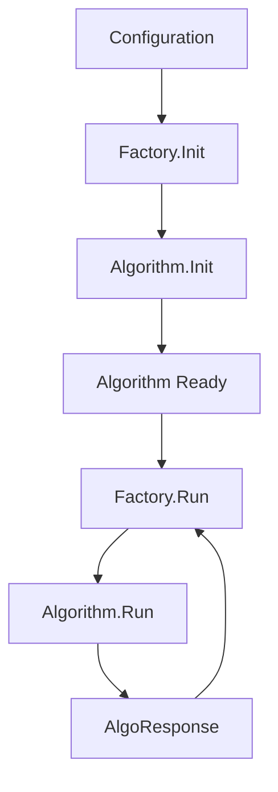

# Getting Started

This guide walks you through your first algorithm integration with PaiRec. You'll learn how to configure, initialize, and use algorithms through practical examples.

## Table of Contents
- [Quick Setup](#quick-setup)
- [Your First Algorithm](#your-first-algorithm)
- [Understanding the Flow](#understanding-the-flow)
- [Common Patterns](#common-patterns)
- [Troubleshooting](#troubleshooting)
- [Next Steps](#next-steps)

## Quick Setup

### Prerequisites

Ensure you have:
- Go 1.18+ installed
- PaiRec project cloned and built
- Basic understanding of [Core Concepts](01-core-concepts.md)

### Verify Installation

```bash
# Build PaiRec to ensure everything works
cd /path/to/pairec
go build .

# Check algorithm package
go test ./algorithm/... -v
```

## Your First Algorithm

Let's start with the simplest algorithm type: **LOOKUP**. This algorithm reads scores from feature data - perfect for learning the basics.

### Step 1: Create Configuration

Create a minimal configuration file `config.json`:

```json
{
  "listen_conf": {
    "http_port": 8000,
    "http_addr": "0.0.0.0"
  },
  "algo_confs": [
    {
      "name": "simple-lookup",
      "type": "LOOKUP",
      "lookup_conf": {
        "field_name": "score"
      }
    }
  ],
  "scene_confs": [
    {
      "scene_id": "test",
      "algo_names": ["simple-lookup"]
    }
  ]
}
```

**Configuration Breakdown:**
- `algo_confs`: List of algorithms to initialize
- `name`: Unique identifier for this algorithm instance
- `type`: Algorithm type (must match factory types)
- `lookup_conf`: Algorithm-specific configuration
- `scene_confs`: How algorithms are used in recommendation scenarios

### Step 2: Initialize the Algorithm

```go
package main

import (
    "fmt"
    "log"
    
    "github.com/alibaba/pairec/v2/algorithm"
    "github.com/alibaba/pairec/v2/recconf"
)

func main() {
    // 1. Create algorithm configuration
    config := recconf.AlgoConfig{
        Name: "simple-lookup",
        Type: "LOOKUP",
        LookupConf: recconf.LookupConfig{
            FieldName: "score",
        },
    }
    
    // 2. Initialize algorithm factory
    algorithm.Load(&recconf.RecommendConfig{
        AlgoConfs: []recconf.AlgoConfig{config},
    })
    
    fmt.Println("Algorithm initialized successfully!")
}
```

**📍 Code Reference**: See [`algorithm/algorithm.go:123-125`](../../algorithm/algorithm.go#L123-L125) for the `Load` function.

### Step 3: Prepare Input Data

LOOKUP algorithms expect feature data with score fields:

```go
// Input data: slice of feature maps
inputData := []map[string]interface{}{
    {
        "item_id": "item1",
        "score":   0.85,    // This field will be extracted
        "category": "electronics",
    },
    {
        "item_id": "item2", 
        "score":   0.72,
        "category": "books",
    },
    {
        "item_id": "item3",
        "score":   0.91,
        "category": "electronics",
    },
}
```

### Step 4: Run the Algorithm

```go
// Run the algorithm
result, err := algorithm.Run("simple-lookup", inputData)
if err != nil {
    log.Fatalf("Algorithm failed: %v", err)
}

// Process results
if responses, ok := result.([]algorithm.AlgoResponse); ok {
    for i, response := range responses {
        fmt.Printf("Item %d score: %.2f\n", i+1, response.GetScore())
    }
}
```

**Expected Output:**
```
Item 1 score: 0.85
Item 2 score: 0.72  
Item 3 score: 0.91
```

### Complete Example

Here's the full working example:

```go
// file: examples/simple_algorithm.go
package main

import (
    "fmt"
    "log"
    
    "github.com/alibaba/pairec/v2/algorithm"
    "github.com/alibaba/pairec/v2/algorithm/response"
    "github.com/alibaba/pairec/v2/recconf"
)

func main() {
    // 1. Configure algorithm
    config := recconf.AlgoConfig{
        Name: "simple-lookup",
        Type: "LOOKUP", 
        LookupConf: recconf.LookupConfig{
            FieldName: "score",
        },
    }
    
    // 2. Initialize
    algorithm.Load(&recconf.RecommendConfig{
        AlgoConfs: []recconf.AlgoConfig{config},
    })
    
    // 3. Prepare data
    inputData := []map[string]interface{}{
        {"item_id": "item1", "score": 0.85},
        {"item_id": "item2", "score": 0.72},
        {"item_id": "item3", "score": 0.91},
    }
    
    // 4. Run algorithm
    result, err := algorithm.Run("simple-lookup", inputData)
    if err != nil {
        log.Fatalf("Failed: %v", err)
    }
    
    // 5. Process results
    if responses, ok := result.([]response.AlgoResponse); ok {
        fmt.Printf("Found %d scored items:\n", len(responses))
        for i, resp := range responses {
            fmt.Printf("  Item %d: score=%.2f\n", i+1, resp.GetScore())
        }
    }
}
```

**📍 Implementation Reference**: See [`algorithm/lookup.go`](../../algorithm/lookup.go) for the complete LOOKUP algorithm implementation.

## Understanding the Flow

### The Algorithm Lifecycle



### Detailed Steps

1. **Configuration Loading** (`algorithm.Load`)
   - Reads algorithm configurations
   - Validates configuration format
   - Creates configuration signatures for change detection

2. **Algorithm Initialization** (`factory.Init`)
   - Creates algorithm instances based on type
   - Calls `Init()` method on each algorithm
   - Registers algorithms in factory map

3. **Request Processing** (`algorithm.Run`)
   - Looks up algorithm by name
   - Applies any request data transformations
   - Calls algorithm's `Run()` method
   - Returns results

### Error Handling

Common error scenarios and how to handle them:

```go
// 1. Configuration errors (caught during Init)
config := recconf.AlgoConfig{
    Name: "test",
    Type: "INVALID_TYPE",  // ❌ Unsupported type
}
algorithm.Load(&recconf.RecommendConfig{AlgoConfs: []recconf.AlgoConfig{config}})
// Error: "algorithm type not support, type:INVALID_TYPE"

// 2. Runtime errors (caught during Run) 
result, err := algorithm.Run("nonexistent", data)
if err != nil {
    // Error: "not found algorithm, name:nonexistent"
}

// 3. Data format errors
invalidData := "not a valid input format"
result, err := algorithm.Run("simple-lookup", invalidData)
// Will panic or error depending on algorithm implementation
```

## Common Patterns

### Pattern 1: Multiple Algorithms

Configure and use multiple algorithms:

```json
{
  "algo_confs": [
    {
      "name": "content-similarity",
      "type": "FAISS",
      "vector_conf": {
        "server_address": "localhost:8001"
      }
    },
    {
      "name": "user-behavior",
      "type": "LOOKUP", 
      "lookup_conf": {
        "field_name": "behavior_score"
      }
    }
  ]
}
```

```go
// Use different algorithms for different purposes
similarityResult, _ := algorithm.Run("content-similarity", vectorData)
behaviorResult, _ := algorithm.Run("user-behavior", featureData)
```

### Pattern 2: Dynamic Configuration

Update algorithms without restart:

```go
// Add new algorithm at runtime
newConfig := recconf.AlgoConfig{
    Name: "new-ranker",
    Type: "EAS",
    EasConf: recconf.EasConfig{
        Url: "https://new-model-endpoint.com",
    },
}

algorithm.AddAlgoWithSign(newConfig)  // Only adds if config changed
```

### Pattern 3: Custom Request Processing

Transform input data before algorithm processing:

```go
// Register custom data transformation
algorithm.RegistRequestDataFunc("my-algorithm", func(name string, data interface{}) interface{} {
    // Transform data as needed
    if features, ok := data.(map[string]interface{}); ok {
        // Add computed features
        features["computed_score"] = computeScore(features)
        return features
    }
    return data
})
```

### Pattern 4: Response Processing

Handle different response types:

```go
result, err := algorithm.Run("my-algorithm", data)
if err != nil {
    return nil, err
}

switch responses := result.(type) {
case []response.AlgoResponse:
    // Standard responses
    for _, resp := range responses {
        score := resp.GetScore()
        scoreMap := resp.GetScoreMap()  // May be nil
        // Process scores...
    }
    
case []response.AlgoMultiClassifyResponse:
    // Multi-classification responses
    for _, resp := range responses {
        classes := resp.GetClassifyMap()
        // Process classifications...
    }
    
default:
    return nil, fmt.Errorf("unexpected response type: %T", result)
}
```

## Troubleshooting

### Common Issues

#### Issue 1: "algorithm type not support"
```
Error: algorithm type not support, type:TENSORFLOW
```

**Solution**: Check supported types in [`algorithm/algorithm.go`](../../algorithm/algorithm.go):
- Valid types: `EAS`, `FAISS`, `LOOKUP`, `SELDON`, `TFSERVING`, `MILVUS`
- Case-sensitive matching

#### Issue 2: "not found algorithm"
```
Error: not found algorithm, name:my-algo
```

**Solution**: Ensure algorithm is properly initialized:
```go
// Check if algorithm was loaded
algorithm.Load(config)  // Must be called before Run

// Verify algorithm name matches configuration
result, err := algorithm.Run("exact-name-from-config", data)
```

#### Issue 3: Data Format Errors
```
panic: interface conversion: string is not []map[string]interface{}
```

**Solution**: Match input data format to algorithm expectations:
```go
// LOOKUP expects: []map[string]interface{}
data := []map[string]interface{}{
    {"field": "value"},
}

// FAISS expects: vector data or search parameters
// Check specific algorithm documentation
```

#### Issue 4: Configuration Validation
```
Error: init algorithm error, name:test, err:URL cannot be empty
```

**Solution**: Provide all required configuration fields:
```json
{
  "name": "test",
  "type": "EAS",
  "eas_conf": {
    "url": "https://required-endpoint.com",  // ✅ Required field
    "processor": "TensorFlow",
    "timeout": 5000
  }
}
```

### Debug Techniques

#### 1. Enable Detailed Logging
```go
import "github.com/alibaba/pairec/v2/log"

// Enable debug logging to see internal operations
log.Info("Running algorithm with data: %+v", inputData)
```

#### 2. Inspect Algorithm State
```go
// Check what algorithms are registered
// (Note: This requires adding debug methods to the factory)
```

#### 3. Validate Configuration
```go
// Test configuration before using
func validateConfig(config recconf.AlgoConfig) error {
    switch config.Type {
    case "LOOKUP":
        if config.LookupConf.FieldName == "" {
            return fmt.Errorf("lookup field_name is required")
        }
    case "EAS":
        if config.EasConf.Url == "" {
            return fmt.Errorf("EAS URL is required")
        }
    }
    return nil
}
```

## Next Steps

Congratulations! You've successfully:
- ✅ Configured your first algorithm
- ✅ Initialized the algorithm factory  
- ✅ Processed algorithm responses
- ✅ Learned common patterns and troubleshooting

### Where to Go Next

1. **[Simple Algorithms](03-simple-algorithms.md)** - Deep dive into LOOKUP algorithm
2. **[Vector Search](04-vector-search.md)** - Learn FAISS and Milvus for similarity search
3. **[ML Serving](05-ml-serving.md)** - Integrate production ML models with EAS and TensorFlow Serving
4. **[Configuration Guide](07-configuration.md)** - Master all configuration options

### Practice Exercises

Try these to reinforce your learning:

1. **Multiple Algorithms**: Configure 2+ different algorithm types in one setup
2. **Error Handling**: Intentionally break configurations to see error messages
3. **Data Transformation**: Create custom request data functions
4. **Performance Testing**: Measure algorithm response times with different data sizes

**Need Help?** Check the [API Reference](10-api-reference.md) for complete method documentation.