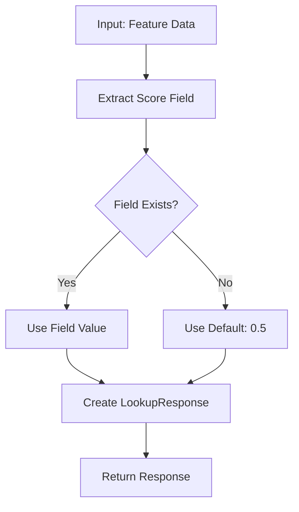

# Simple Algorithms

This guide provides an in-depth exploration of PaiRec's simplest algorithm: **LOOKUP**. You'll learn how it works internally, when to use it, and how to extend it for your needs.

## Table of Contents
- [LOOKUP Algorithm Overview](#lookup-algorithm-overview)
- [How LOOKUP Works](#how-lookup-works)
- [Configuration Options](#configuration-options)
- [Use Cases and Examples](#use-cases-and-examples)
- [Performance Characteristics](#performance-characteristics)
- [Advanced Usage](#advanced-usage)
- [Extending LOOKUP](#extending-lookup)

## LOOKUP Algorithm Overview

### What is LOOKUP?

The LOOKUP algorithm is PaiRec's simplest scoring mechanism. It extracts pre-computed scores from feature data without any complex computation. Think of it as a "score reader" rather than a "score computer."

**📍 File Reference**: [`algorithm/lookup.go`](../../algorithm/lookup.go)

### When to Use LOOKUP

| ✅ Good For | ❌ Not Good For |
|-------------|-----------------|
| Pre-computed scores from other systems | Real-time ML inference |
| Feature-based scoring | Vector similarity search |
| A/B testing score variants | Complex multi-signal fusion |
| Simple rule-based scoring | Dynamic scoring based on context |
| Debugging and baseline comparisons | Learning-based algorithms |

### Core Components

```go
type LookupPolicy struct {
    conf *recconf.LookupConfig  // Configuration
}

type LookupResponse struct {
    score float64               // The extracted score
}

type LookupConfig struct {
    FieldName string `json:"field_name"`  // Which field to extract
}
```

## How LOOKUP Works

### Algorithm Flow



### Step-by-Step Execution

Let's trace through the LOOKUP algorithm with an example:

```go
// 1. Input data
inputData := []map[string]interface{}{
    {"item_id": "book1", "relevance_score": 0.85, "category": "fiction"},
    {"item_id": "book2", "popularity": 0.72},  // No relevance_score field
    {"item_id": "book3", "relevance_score": 0.91, "category": "tech"},
}

// 2. Configuration
config := LookupConfig{
    FieldName: "relevance_score",  // Extract this field
}

// 3. Processing
//   - book1: relevance_score = 0.85 → LookupResponse{score: 0.85}
//   - book2: no relevance_score → LookupResponse{score: 0.5} (default)
//   - book3: relevance_score = 0.91 → LookupResponse{score: 0.91}

// 4. Output
[]AlgoResponse{
    &LookupResponse{score: 0.85},
    &LookupResponse{score: 0.5},   // Default fallback
    &LookupResponse{score: 0.91},
}
```

### Source Code Analysis

Let's examine the core implementation:

```go
func (m *LookupPolicy) Run(algoData interface{}) (interface{}, error) {
    // 1. Type assertion - expect slice of feature maps
    featureList := algoData.([]map[string]interface{})
    
    // 2. Handle empty input
    if len(featureList) == 0 {
        return nil, nil
    }
    
    // 3. Process each feature map
    result := make([]response.AlgoResponse, len(featureList))
    for i, f := range featureList {
        // 4. Extract score from configured field
        if score, ok := f[m.conf.FieldName]; ok {
            result[i] = &LookupResponse{score: score.(float64)}
        } else {
            // 5. Default fallback
            result[i] = &LookupResponse{score: 0.5}
        }
    }
    
    return result, nil
}
```

**📍 Source Reference**: [`algorithm/lookup.go:37-51`](../../algorithm/lookup.go#L37-L51)

### Key Design Decisions

#### 1. **Default Score Strategy**
When the configured field is missing, LOOKUP returns `0.5`:
```go
// Why 0.5?
// - Neutral score (middle of 0-1 range)
// - Indicates "unknown quality" rather than "bad quality" (0) or "good quality" (1)
// - Allows ranking algorithms to handle missing data gracefully
```

#### 2. **Type Safety**
```go
// Current implementation assumes float64:
score.(float64)

// More robust approach would be:
func extractScore(value interface{}) float64 {
    switch v := value.(type) {
    case float64:
        return v
    case float32:
        return float64(v)
    case int:
        return float64(v)
    case string:
        if f, err := strconv.ParseFloat(v, 64); err == nil {
            return f
        }
    }
    return 0.5  // Default fallback
}
```

#### 3. **Performance Optimization**
```go
// Pre-allocates result slice for efficiency
result := make([]response.AlgoResponse, len(featureList))

// Avoids dynamic slice growth during processing
```

## Configuration Options

### Basic Configuration

```json
{
  "name": "score-extractor",
  "type": "LOOKUP",
  "lookup_conf": {
    "field_name": "ml_score"
  }
}
```

### Configuration Fields

| Field | Type | Required | Default | Description |
|-------|------|----------|---------|-------------|
| `field_name` | `string` | ✅ Yes | N/A | Name of the field to extract score from |

### Configuration Examples

#### Example 1: Basic Relevance Scoring
```json
{
  "name": "relevance-lookup",
  "type": "LOOKUP", 
  "lookup_conf": {
    "field_name": "relevance"
  }
}
```

#### Example 2: Popularity-Based Scoring  
```json
{
  "name": "popularity-lookup",
  "type": "LOOKUP",
  "lookup_conf": {
    "field_name": "popularity_score"
  }
}
```

#### Example 3: Multi-Algorithm Setup
```json
{
  "algo_confs": [
    {
      "name": "content-relevance",
      "type": "LOOKUP",
      "lookup_conf": {
        "field_name": "content_score"
      }
    },
    {
      "name": "user-preference", 
      "type": "LOOKUP",
      "lookup_conf": {
        "field_name": "preference_score"
      }
    }
  ]
}
```

## Use Cases and Examples

### Use Case 1: Pre-computed ML Scores

**Scenario**: You have an offline ML pipeline that pre-computes item scores and stores them in your feature store.

```go
// Input from feature store
items := []map[string]interface{}{
    {
        "item_id": "product_123",
        "ml_score": 0.87,           // Pre-computed ML score
        "price": 29.99,
        "category": "electronics",
    },
    {
        "item_id": "product_456", 
        "ml_score": 0.93,
        "price": 15.50,
        "category": "books",
    },
}

// Configuration
config := recconf.AlgoConfig{
    Name: "ml-scores",
    Type: "LOOKUP",
    LookupConf: recconf.LookupConfig{
        FieldName: "ml_score",
    },
}

// Usage
result, _ := algorithm.Run("ml-scores", items)
// Returns: scores [0.87, 0.93]
```

### Use Case 2: A/B Testing Score Variants

**Scenario**: Testing different scoring strategies by pre-computing multiple score variants.

```go
// Feature data with multiple score variants
testData := []map[string]interface{}{
    {
        "item_id": "item1",
        "score_v1": 0.75,    // Baseline algorithm
        "score_v2": 0.82,    // New algorithm variant
        "score_v3": 0.68,    // Conservative variant
    },
    {
        "item_id": "item2",
        "score_v1": 0.91,
        "score_v2": 0.89,
        "score_v3": 0.95,
    },
}

// Different algorithms for A/B testing
configs := []recconf.AlgoConfig{
    {Name: "baseline", Type: "LOOKUP", LookupConf: recconf.LookupConfig{FieldName: "score_v1"}},
    {Name: "variant_a", Type: "LOOKUP", LookupConf: recconf.LookupConfig{FieldName: "score_v2"}},
    {Name: "variant_b", Type: "LOOKUP", LookupConf: recconf.LookupConfig{FieldName: "score_v3"}},
}

// Route users to different variants
userGroup := getUserExperimentGroup(userID)
algoName := map[string]string{
    "control": "baseline",
    "test_a":  "variant_a", 
    "test_b":  "variant_b",
}[userGroup]

result, _ := algorithm.Run(algoName, testData)
```

### Use Case 3: Business Rule Scoring

**Scenario**: Applying business rules through pre-computed scores.

```go
// Business logic applied offline
businessData := []map[string]interface{}{
    {
        "item_id": "premium_item",
        "base_score": 0.85,
        "business_boost": 1.2,      // Premium items get boost
        "final_score": 0.85 * 1.2,  // = 1.02, capped to 1.0
    },
    {
        "item_id": "discounted_item",
        "base_score": 0.70,
        "business_boost": 0.9,      // Discounted items get penalty
        "final_score": 0.70 * 0.9,  // = 0.63
    },
}

config := recconf.AlgoConfig{
    Name: "business-rules",
    Type: "LOOKUP",
    LookupConf: recconf.LookupConfig{
        FieldName: "final_score",
    },
}
```

### Use Case 4: Fallback and Default Handling

**Scenario**: Graceful handling of missing scores with meaningful defaults.

```go
// Mixed data quality
mixedData := []map[string]interface{}{
    {"item_id": "good_item", "quality_score": 0.88},     // Has score
    {"item_id": "new_item"},                             // Missing score → 0.5 default
    {"item_id": "bad_item", "quality_score": 0.23},     // Has low score
}

// LOOKUP gracefully handles missing data
result, _ := algorithm.Run("quality-lookup", mixedData)
// Results: [0.88, 0.5, 0.23]
//          ^     ^    ^
//          |     |    Low quality item
//          |     Default for missing score  
//          High quality item
```

## Performance Characteristics

### Time Complexity
- **O(n)** where n is the number of items
- Each item requires one map lookup operation
- Linear scaling with input size

### Space Complexity
- **O(n)** for output response slice
- **O(1)** additional memory per item
- No caching or intermediate data structures

### Benchmarks

```go
// Typical performance characteristics
func BenchmarkLookupAlgorithm(b *testing.B) {
    // Setup data
    data := make([]map[string]interface{}, 1000)
    for i := range data {
        data[i] = map[string]interface{}{
            "item_id": fmt.Sprintf("item_%d", i),
            "score":   rand.Float64(),
        }
    }
    
    // Benchmark
    b.ResetTimer()
    for i := 0; i < b.N; i++ {
        algorithm.Run("lookup-test", data)
    }
}

// Results (approximate):
// 1,000 items:   ~50 μs
// 10,000 items:  ~500 μs  
// 100,000 items: ~5 ms
```

### Performance Tips

1. **Optimize Field Access**:
   ```go
   // ✅ Use simple field names
   "score"           // Fast map lookup
   
   // ❌ Avoid complex nested access  
   "nested.deep.score"  // Would require parsing
   ```

2. **Pre-process Data**:
   ```go
   // ✅ Extract scores during data loading
   for _, item := range rawItems {
       item["computed_score"] = computeScore(item)
   }
   
   // ❌ Don't compute scores in LOOKUP
   // LOOKUP should only extract, not compute
   ```

3. **Batch Processing**:
   ```go
   // ✅ Process all items together
   algorithm.Run("lookup", allItems)
   
   // ❌ Avoid individual item processing
   for _, item := range items {
       algorithm.Run("lookup", []map[string]interface{}{item})  // Inefficient
   }
   ```

## Advanced Usage

### Custom Response Handling

Extend the basic response with additional data:

```go
type ExtendedLookupResponse struct {
    score    float64
    metadata map[string]interface{}
}

func (r *ExtendedLookupResponse) GetScore() float64 {
    return r.score
}

func (r *ExtendedLookupResponse) GetScoreMap() map[string]float64 {
    // Return additional scores if available
    if scoreMap, ok := r.metadata["score_map"].(map[string]float64); ok {
        return scoreMap
    }
    return nil
}

func (r *ExtendedLookupResponse) GetModuleType() bool {
    return false
}
```

### Request Data Transformation

Transform input data before LOOKUP processing:

```go
// Register custom data processor
algorithm.RegistRequestDataFunc("enhanced-lookup", func(name string, data interface{}) interface{} {
    items := data.([]map[string]interface{})
    
    // Enhance each item
    for _, item := range items {
        // Add computed fields
        if baseScore, ok := item["base_score"].(float64); ok {
            if boost, ok := item["boost_factor"].(float64); ok {
                item["final_score"] = math.Min(baseScore*boost, 1.0)
            }
        }
        
        // Normalize scores
        if score, ok := item["raw_score"].(float64); ok {
            item["normalized_score"] = (score - 0.5) * 2.0  // Convert 0.5-1.0 to 0.0-1.0
        }
    }
    
    return items
})
```

### Multi-Field LOOKUP

While LOOKUP natively supports single fields, you can implement multi-field extraction:

```go
// Custom multi-field lookup function
func multiFieldLookup(items []map[string]interface{}, fields []string, weights []float64) []float64 {
    scores := make([]float64, len(items))
    
    for i, item := range items {
        var totalScore float64
        var totalWeight float64
        
        for j, field := range fields {
            if value, ok := item[field].(float64); ok {
                totalScore += value * weights[j]
                totalWeight += weights[j]
            }
        }
        
        if totalWeight > 0 {
            scores[i] = totalScore / totalWeight
        } else {
            scores[i] = 0.5  // Default
        }
    }
    
    return scores
}

// Usage
fields := []string{"relevance", "popularity", "quality"}
weights := []float64{0.5, 0.3, 0.2}
scores := multiFieldLookup(items, fields, weights)
```

## Extending LOOKUP

### Creating a Custom LOOKUP Variant

```go
// Enhanced LOOKUP with validation and transformation
type EnhancedLookupPolicy struct {
    conf      *recconf.LookupConfig
    validator func(float64) bool
    transform func(float64) float64
}

func (m *EnhancedLookupPolicy) Init(conf *recconf.AlgoConfig) error {
    m.conf = &conf.LookupConf
    
    // Set up validation (scores should be in [0, 1])
    m.validator = func(score float64) bool {
        return score >= 0.0 && score <= 1.0
    }
    
    // Set up transformation (apply sigmoid to raw scores)
    m.transform = func(score float64) float64 {
        return 1.0 / (1.0 + math.Exp(-score))
    }
    
    return nil
}

func (m *EnhancedLookupPolicy) Run(algoData interface{}) (interface{}, error) {
    featureList := algoData.([]map[string]interface{})
    if len(featureList) == 0 {
        return nil, nil
    }
    
    result := make([]response.AlgoResponse, len(featureList))
    for i, f := range featureList {
        var finalScore float64 = 0.5  // Default
        
        if rawScore, ok := f[m.conf.FieldName].(float64); ok {
            // Validate score
            if m.validator(rawScore) {
                finalScore = rawScore
            } else {
                // Transform invalid scores
                finalScore = m.transform(rawScore)
            }
        }
        
        result[i] = &LookupResponse{score: finalScore}
    }
    
    return result, nil
}
```

### Integration with Factory

To integrate your custom algorithm:

```go
// 1. Register in algorithm factory
// Modify algorithm/algorithm.go:
case "ENHANCED_LOOKUP":
    algo = NewEnhancedLookupPolicy()
    err := algo.Init(&conf)
    if err != nil {
        return nil, fmt.Errorf("init algorithm error, name:%s, err:%v", conf.Name, err)
    }

// 2. Use in configuration
{
  "name": "enhanced-lookup",
  "type": "ENHANCED_LOOKUP",
  "lookup_conf": {
    "field_name": "raw_score"
  }
}
```

---

## Summary

The LOOKUP algorithm demonstrates PaiRec's design principles:

- **Simplicity**: Minimal, focused functionality
- **Flexibility**: Works with any feature data structure
- **Robustness**: Graceful handling of missing data
- **Performance**: Linear time complexity with minimal overhead
- **Extensibility**: Easy to customize and enhance

### Key Takeaways

1. **LOOKUP is ideal for pre-computed scores** from offline processing
2. **Default fallback (0.5) enables graceful degradation** with missing data
3. **Linear performance** makes it suitable for large-scale real-time serving
4. **Simple configuration** requires only the field name to extract
5. **Extensible design** allows for custom validation and transformation logic

### Next Steps

- **[Vector Search Algorithms](04-vector-search.md)** - Learn FAISS and Milvus for similarity-based scoring
- **[ML Serving Algorithms](05-ml-serving.md)** - Integrate real-time ML models with EAS and TensorFlow Serving
- **[Configuration Guide](07-configuration.md)** - Master advanced configuration patterns
- **[Custom Algorithms](08-custom-algorithms.md)** - Build your own algorithm types