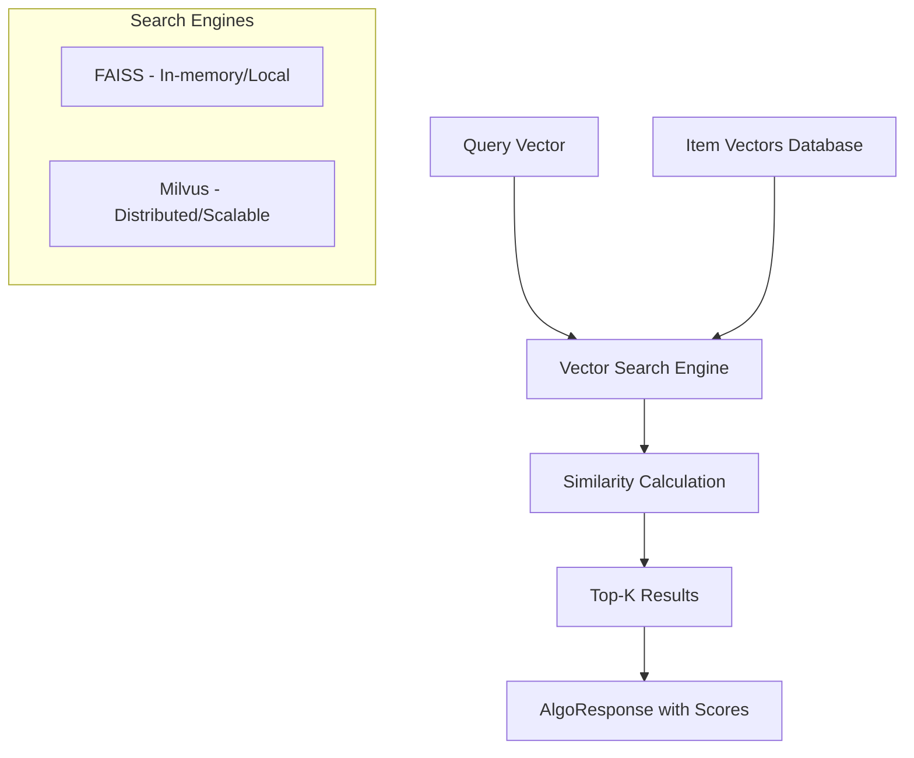

# Vector Search Algorithms

This guide covers PaiRec's vector-based similarity search algorithms: **FAISS** and **Milvus**. These algorithms are essential for content-based recommendations, semantic search, and finding similar items based on embeddings.

## Table of Contents
- [Vector Search Overview](#vector-search-overview)
- [FAISS Algorithm](#faiss-algorithm)
- [Milvus Algorithm](#milvus-algorithm)
- [Comparison: FAISS vs Milvus](#comparison-faiss-vs-milvus)
- [Configuration Patterns](#configuration-patterns)
- [Use Cases and Examples](#use-cases-and-examples)
- [Performance Optimization](#performance-optimization)
- [Advanced Topics](#advanced-topics)

## Vector Search Overview

### What is Vector Search?

Vector search algorithms find items similar to a query by comparing high-dimensional embeddings (vectors). These vectors typically represent:

- **Content Features**: Text embeddings, image features, audio fingerprints
- **User Behavior**: Interaction patterns, preference vectors
- **Item Characteristics**: Product features, content similarities

### When to Use Vector Search

| ✅ Good For | ❌ Not Good For |
|-------------|-----------------|
| Content-based recommendations | Simple score lookups |
| Semantic similarity search | Rule-based filtering |
| Cold-start item recommendations | Real-time feature computation |
| Cross-modal search (text→image) | Simple numerical comparisons |
| Clustering and discovery | Binary decision making |

### Vector Search Architecture



## FAISS Algorithm

### Overview

**FAISS** (Facebook AI Similarity Search) is a library for efficient similarity search of dense vectors. PaiRec integrates FAISS for high-performance, in-memory vector search.

**📍 File References**: 
- [`algorithm/faiss/model.go`](../../algorithm/faiss/model.go)
- [`algorithm/faiss/vector_client.go`](../../algorithm/faiss/vector_client.go)

### Core Components

```go
type FaissModel struct {
    name   string              // Algorithm instance name
    client *VectorClient       // gRPC client for FAISS server
}

type VectorClient struct {
    ServerAddress string                    // FAISS server endpoint
    Timeout       time.Duration             // Request timeout
    VectorClient  pb.VectorRetrievalClient  // gRPC client
}
```

### How FAISS Works in PaiRec

#### 1. **Initialization Process**
```go
func (m *FaissModel) Init(conf *recconf.AlgoConfig) error {
    // Create gRPC client to FAISS server
    client, err := NewVectorClient(
        conf.VectorConf.ServerAddress,  // e.g., "localhost:8080"
        time.Millisecond * time.Duration(conf.VectorConf.Timeout),
    )
    if err != nil {
        return err
    }
    m.client = client
    return nil
}
```

#### 2. **Search Process**
```go
func (m *FaissModel) Run(algoData interface{}) (interface{}, error) {
    // Delegate to vector client
    return m.client.Search(algoData)
}

func (c *VectorClient) Search(requestData interface{}) (*pb.VectorReply, error) {
    request := requestData.(*pb.VectorRequest)  // Expects protobuf request
    ctx, cancel := context.WithTimeout(context.Background(), c.Timeout)
    defer cancel()
    
    // Call FAISS server via gRPC
    reply, err := c.VectorClient.Search(ctx, request)
    return reply, nil
}
```

### FAISS Configuration

```json
{
  "name": "content-similarity",
  "type": "FAISS",
  "vector_conf": {
    "server_address": "localhost:8080",
    "timeout": 100
  }
}
```

#### Configuration Fields

| Field | Type | Required | Description |
|-------|------|----------|-------------|
| `server_address` | `string` | ✅ | FAISS server gRPC endpoint |
| `timeout` | `int` | ✅ | Request timeout in milliseconds |

### FAISS Usage Example

```go
package main

import (
    "fmt"
    "log"
    
    "github.com/alibaba/pairec/v2/algorithm"
    "github.com/alibaba/pairec/v2/algorithm/faiss/pai_web"
    "github.com/alibaba/pairec/v2/recconf"
)

func main() {
    // 1. Configure FAISS algorithm
    config := recconf.AlgoConfig{
        Name: "item-similarity",
        Type: "FAISS",
        VectorConf: recconf.VectorConfig{
            ServerAddress: "localhost:8080",
            Timeout:       500,  // 500ms timeout
        },
    }
    
    // 2. Initialize
    algorithm.Load(&recconf.RecommendConfig{
        AlgoConfs: []recconf.AlgoConfig{config},
    })
    
    // 3. Prepare search request
    request := &pai_web.VectorRequest{
        QueryVector: []float32{0.1, 0.2, 0.3, 0.4},  // Query embedding
        TopK:        10,                              // Return top 10 similar items
        IndexName:   "product_embeddings",           // FAISS index name
    }
    
    // 4. Execute search
    result, err := algorithm.Run("item-similarity", request)
    if err != nil {
        log.Fatalf("FAISS search failed: %v", err)
    }
    
    // 5. Process results
    if reply, ok := result.(*pai_web.VectorReply); ok {
        fmt.Printf("Found %d similar items:\n", len(reply.Results))
        for i, item := range reply.Results {
            fmt.Printf("  %d. ID: %s, Score: %.4f\n", 
                i+1, item.ItemId, item.Score)
        }
    }
}
```

### FAISS Architecture Patterns

#### Pattern 1: Real-time Similarity Search
```go
// User views a product, find similar items
userViewedItem := "product_123"
itemEmbedding := getItemEmbedding(userViewedItem)  // From embedding service

request := &pai_web.VectorRequest{
    QueryVector: itemEmbedding,
    TopK:        20,
    IndexName:   "product_embeddings",
}

similar, _ := algorithm.Run("content-similarity", request)
```

#### Pattern 2: User Preference Matching
```go
// Find items matching user's preference vector
userProfile := getUserPreferenceVector(userID)

request := &pai_web.VectorRequest{
    QueryVector: userProfile,
    TopK:        50,
    IndexName:   "item_features",
    Filters:     []string{"category=electronics", "price<100"},  // Optional filters
}

recommendations, _ := algorithm.Run("preference-match", request)
```

## Milvus Algorithm

### Overview

**Milvus** is an open-source vector database designed for scalable similarity search. It supports distributed deployment, multiple index types, and advanced querying capabilities.

**📍 File References**:
- [`algorithm/milvus/model.go`](../../algorithm/milvus/model.go)
- [`algorithm/milvus/request.go`](../../algorithm/milvus/request.go)

### Core Components

```go
type MilvusModel struct {
    name   string           // Algorithm instance name
    client client.Client    // Milvus SDK client
}

type MilvusRequest struct {
    TopK           int                      // Number of results to return
    CollectionName string                   // Milvus collection name
    VectorField    string                   // Field containing vectors
    OutputFields   []string                 // Fields to return in results
    Vectors        []entity.Vector          // Query vectors
    Partitions     []string                 // Optional partitions to search
    Expr           string                   // Filter expression
    MetricType     entity.MetricType        // Distance metric (IP, L2, etc.)
    SearchParams   *MilvusSearchParams      // Search-specific parameters
}
```

### How Milvus Works in PaiRec

#### 1. **Initialization Process**
```go
func (m *MilvusModel) Init(conf *recconf.AlgoConfig) error {
    ctx := context.Background()
    ctx, cancel := context.WithTimeout(ctx, 
        time.Millisecond*time.Duration(conf.MilvusConf.Timeout))
    defer cancel()
    
    // Connect to Milvus server
    client, err := client.NewGrpcClient(ctx, conf.MilvusConf.ServerAddress)
    if err != nil {
        return err
    }
    
    m.client = client
    return nil
}
```

#### 2. **Search Process**
```go
func (m *MilvusModel) Run(algoData interface{}) (interface{}, error) {
    request, ok := algoData.(*MilvusRequest)
    if !ok {
        return nil, errors.New("requestData is not MilvusRequest type")
    }
    
    // Execute search via Milvus SDK
    return m.client.Search(
        context.Background(),
        request.CollectionName,
        request.Partitions,
        request.Expr,          // Filter expression
        request.OutputFields,  // Fields to return
        request.Vectors,       // Query vectors
        request.VectorField,   // Vector field name
        request.MetricType,    // Distance metric
        request.TopK,         // Number of results
        request.SearchParams, // Search parameters
    )
}
```

### Milvus Configuration

```json
{
  "name": "semantic-search",
  "type": "MILVUS", 
  "milvus_conf": {
    "server_address": "localhost:19530",
    "timeout": 1000
  }
}
```

#### Configuration Fields

| Field | Type | Required | Description |
|-------|------|----------|-------------|
| `server_address` | `string` | ✅ | Milvus server gRPC endpoint |
| `timeout` | `int` | ✅ | Connection timeout in milliseconds |

### Milvus Usage Example

```go
package main

import (
    "fmt"
    "log"
    
    "github.com/alibaba/pairec/v2/algorithm"
    "github.com/alibaba/pairec/v2/algorithm/milvus"
    "github.com/alibaba/pairec/v2/recconf"
    "github.com/milvus-io/milvus-sdk-go/v2/entity"
)

func main() {
    // 1. Configure Milvus algorithm
    config := recconf.AlgoConfig{
        Name: "text-similarity",
        Type: "MILVUS",
        MilvusConf: recconf.MilvusConfig{
            ServerAddress: "localhost:19530",
            Timeout:       2000,  // 2 second timeout
        },
    }
    
    // 2. Initialize
    algorithm.Load(&recconf.RecommendConfig{
        AlgoConfs: []recconf.AlgoConfig{config},
    })
    
    // 3. Prepare search request
    request := milvus.NewMilvusRequest()
    request.CollectionName = "document_embeddings"
    request.VectorField = "text_vector"
    request.TopK = 15
    request.SetMetricType("IP")  // Inner Product similarity
    request.OutputFields = []string{"document_id", "title", "category"}
    request.Expr = "category in ['technology', 'science']"  // Filter results
    
    // Add query vector (e.g., from text embedding model)
    queryEmbedding := []float32{0.1, 0.2, 0.3, /* ... 768 dimensions */}
    request.AppendVectors(queryEmbedding)
    
    // Set search parameters for performance tuning
    request.SetSearchParams(map[string]interface{}{
        "nprobe": 16,     // Number of clusters to search
        "ef":     64,     // Search depth for HNSW index
    })
    
    // 4. Execute search
    result, err := algorithm.Run("text-similarity", request)
    if err != nil {
        log.Fatalf("Milvus search failed: %v", err)
    }
    
    // 5. Process results (Milvus returns native SDK result)
    fmt.Printf("Search completed: %+v\n", result)
}
```

### Milvus Advanced Features

#### 1. **Partitioned Search**
```go
// Search only specific partitions for better performance
request := milvus.NewMilvusRequest()
request.CollectionName = "user_embeddings"
request.Partitions = []string{"active_users", "premium_users"}
request.VectorField = "behavior_vector"
request.TopK = 20
```

#### 2. **Complex Filtering**
```go
// Sophisticated filter expressions
request.Expr = `
    (category in ["electronics", "books"]) and 
    (price > 10 and price < 100) and
    (rating >= 4.0)
`
```

#### 3. **Multi-Vector Search**
```go
// Search with multiple query vectors simultaneously
request := milvus.NewMilvusRequest()
request.AppendVectors([]float32{/* vector 1 */})
request.AppendVectors([]float32{/* vector 2 */})
request.AppendVectors([]float32{/* vector 3 */})
// Returns results for all query vectors
```

## Comparison: FAISS vs Milvus

### Feature Comparison

| Feature | FAISS | Milvus |
|---------|-------|--------|
| **Deployment** | Single-node server | Distributed cluster |
| **Scalability** | Vertical scaling | Horizontal scaling |
| **Data Management** | In-memory indices | Persistent storage |
| **Query Language** | gRPC requests | Rich filter expressions |
| **Index Types** | 50+ index types | Multiple optimized indices |
| **Real-time Updates** | Batch rebuilds | Incremental updates |
| **Multi-tenancy** | Limited | Full partition support |
| **Monitoring** | Basic | Rich metrics & dashboards |

### Performance Characteristics

| Metric | FAISS | Milvus |
|--------|-------|--------|
| **Latency** | 1-10ms | 5-50ms |
| **Throughput** | Very High | High |
| **Memory Usage** | High (all in RAM) | Moderate (disk + cache) |
| **Setup Complexity** | Simple | Moderate |
| **Operational Overhead** | Low | Moderate |

### When to Choose Which

#### Choose FAISS When:
- **Low latency requirements** (< 10ms)
- **Simple deployment** preferred
- **Dataset fits in memory** (< 100M vectors)
- **High QPS** requirements (> 10K QPS)
- **Minimal operational complexity**

#### Choose Milvus When:
- **Large-scale datasets** (> 100M vectors)
- **Complex filtering** requirements
- **Distributed architecture** needed
- **Real-time data updates** required
- **Multi-tenant scenarios**

## Configuration Patterns

### Environment-Specific Configurations

#### Development Environment
```json
{
  "algo_confs": [
    {
      "name": "dev-similarity",
      "type": "FAISS",
      "vector_conf": {
        "server_address": "localhost:8080",
        "timeout": 1000
      }
    }
  ]
}
```

#### Production Environment
```json
{
  "algo_confs": [
    {
      "name": "prod-similarity",
      "type": "MILVUS",
      "milvus_conf": {
        "server_address": "milvus-cluster.internal:19530",
        "timeout": 500
      }
    }
  ]
}
```

### Multi-Algorithm Setup

Use both FAISS and Milvus for different purposes:

```json
{
  "algo_confs": [
    {
      "name": "fast-similarity",
      "type": "FAISS",
      "vector_conf": {
        "server_address": "faiss-server:8080",
        "timeout": 100
      }
    },
    {
      "name": "complex-search",
      "type": "MILVUS",
      "milvus_conf": {
        "server_address": "milvus-cluster:19530", 
        "timeout": 1000
      }
    }
  ]
}
```

## Use Cases and Examples

### Use Case 1: Content-Based Recommendations

**Scenario**: E-commerce platform recommending similar products based on product embeddings.

```go
// Get product embedding from ML model
productID := "laptop_123"
productEmbedding := getProductEmbedding(productID)

// FAISS search for real-time recommendations
request := &pai_web.VectorRequest{
    QueryVector: productEmbedding,
    TopK:        20,
    IndexName:   "product_embeddings",
}

similarProducts, _ := algorithm.Run("product-similarity", request)
```

### Use Case 2: Semantic Text Search

**Scenario**: Document search system finding semantically similar articles.

```go
// Convert user query to embedding
userQuery := "machine learning algorithms"
queryEmbedding := textToEmbedding(userQuery)

// Milvus search with filtering
request := milvus.NewMilvusRequest()
request.CollectionName = "articles"
request.VectorField = "text_embedding"
request.TopK = 10
request.SetMetricType("IP")
request.Expr = "publish_date > '2023-01-01' and category in ['AI', 'ML']"
request.AppendVectors(queryEmbedding)

relevantArticles, _ := algorithm.Run("semantic-search", request)
```

### Use Case 3: User Behavior Matching

**Scenario**: Finding users with similar behavior patterns for collaborative filtering.

```go
// Get user behavior embedding
userID := "user_456"
behaviorVector := getUserBehaviorEmbedding(userID)

// Search for similar users
request := milvus.NewMilvusRequest()
request.CollectionName = "user_profiles"
request.VectorField = "behavior_embedding"
request.TopK = 50
request.Expr = "active_in_last_30_days = true"
request.AppendVectors(behaviorVector)

similarUsers, _ := algorithm.Run("user-similarity", request)
```

### Use Case 4: Cold Start Item Discovery

**Scenario**: Recommending new items with no interaction history using content features.

```go
// For new items, use content-based similarity
newItemFeatures := extractItemFeatures(newItemID)
contentEmbedding := featuresToEmbedding(newItemFeatures)

// Find items with similar content features
request := &pai_web.VectorRequest{
    QueryVector: contentEmbedding,
    TopK:        30,
    IndexName:   "content_features",
}

relatedItems, _ := algorithm.Run("content-similarity", request)
```

## Performance Optimization

### FAISS Optimization

#### 1. **Index Selection**
```protobuf
// Configure FAISS server with appropriate index
// For high accuracy: IVF4096,PQ64
// For speed: IVF1024,Flat
// For memory efficiency: IVF2048,PQ32
```

#### 2. **Batch Processing**
```go
// Process multiple queries together
requests := []*pai_web.VectorRequest{
    {QueryVector: vector1, TopK: 10},
    {QueryVector: vector2, TopK: 10},
    {QueryVector: vector3, TopK: 10},
}

// More efficient than individual requests
```

#### 3. **Connection Pooling**
```go
// Use connection pooling for high-throughput scenarios
type PooledFaissClient struct {
    pool chan *VectorClient
}

func (p *PooledFaissClient) getClient() *VectorClient {
    return <-p.pool
}

func (p *PooledFaissClient) returnClient(client *VectorClient) {
    p.pool <- client
}
```

### Milvus Optimization

#### 1. **Index Configuration**
```go
// Optimize search parameters for your use case
searchParams := map[string]interface{}{
    "nprobe": 32,          // Higher = more accurate, slower
    "ef":     128,         // Higher = more accurate, slower  
    "search_k": 100,       // Higher = more accurate, slower
}
request.SetSearchParams(searchParams)
```

#### 2. **Partitioning Strategy**
```go
// Partition by time, category, or user segment
request.Partitions = []string{
    "partition_2024_01",
    "partition_2024_02", 
}
// Searches only relevant partitions
```

#### 3. **Field Selection**
```go
// Only return needed fields to reduce network overhead
request.OutputFields = []string{"id", "score"}  // Minimal fields
// vs
request.OutputFields = []string{"*"}  // All fields (slower)
```

### General Performance Tips

#### 1. **Vector Dimensions**
```go
// Balance accuracy vs performance
// 128-512 dimensions: Good balance
// 768-1024 dimensions: High accuracy, slower
// 1536+ dimensions: Very high accuracy, much slower
```

#### 2. **TopK Selection**
```go
// Request only what you need
request.TopK = 20   // ✅ For recommendation lists
request.TopK = 500  // ❌ Usually unnecessary, slower
```

#### 3. **Timeout Tuning**
```json
{
  "vector_conf": {
    "timeout": 100    // Fast for real-time
  },
  "milvus_conf": {
    "timeout": 1000   // Longer for complex queries
  }
}
```

## Advanced Topics

### Custom Vector Processing

```go
// Register custom vector preprocessing
algorithm.RegistRequestDataFunc("normalized-faiss", func(name string, data interface{}) interface{} {
    if request, ok := data.(*pai_web.VectorRequest); ok {
        // Normalize query vector
        request.QueryVector = normalizeVector(request.QueryVector)
        return request
    }
    return data
})
```

### Multi-Modal Search

```go
// Combine different vector types
type MultiModalRequest struct {
    TextVector  []float32
    ImageVector []float32
    UserVector  []float32
}

// Weight and combine vectors
func combineVectors(req *MultiModalRequest) []float32 {
    combined := make([]float32, len(req.TextVector))
    for i := range combined {
        combined[i] = 0.5*req.TextVector[i] + 
                     0.3*req.ImageVector[i] + 
                     0.2*req.UserVector[i]
    }
    return combined
}
```

### Hybrid Search Strategies

```go
// Combine vector search with other algorithms
func hybridRecommendation(userID string, itemID string) []string {
    // 1. Vector similarity
    vectorResults, _ := algorithm.Run("content-similarity", vectorRequest)
    
    // 2. Collaborative filtering  
    cfResults, _ := algorithm.Run("user-similarity", cfRequest)
    
    // 3. Business rules
    ruleResults, _ := algorithm.Run("business-rules", ruleRequest)
    
    // 4. Combine and re-rank
    return combineAndRank(vectorResults, cfResults, ruleResults)
}
```

---

## Summary

Vector search algorithms in PaiRec provide powerful capabilities for:

- **Content-based recommendations** using item embeddings
- **Semantic search** across text, images, and multimedia
- **User similarity matching** for collaborative filtering
- **Cold-start handling** for new items and users

### Key Takeaways

1. **FAISS excels at low-latency, high-throughput scenarios** with in-memory indices
2. **Milvus provides scalable, feature-rich vector database capabilities** for complex use cases
3. **Choose based on scale, complexity, and performance requirements**
4. **Both integrate seamlessly with PaiRec's algorithm framework**
5. **Performance optimization requires careful tuning** of indices, parameters, and data organization

### Next Steps

- **[ML Serving Algorithms](05-ml-serving.md)** - Learn EAS, TensorFlow Serving, and Seldon for ML model integration
- **[Response Handling](06-response-handling.md)** - Process and combine results from multiple algorithms
- **[Performance Optimization](09-performance.md)** - Advanced techniques for production deployment
- **[Custom Algorithms](08-custom-algorithms.md)** - Build custom vector search implementations