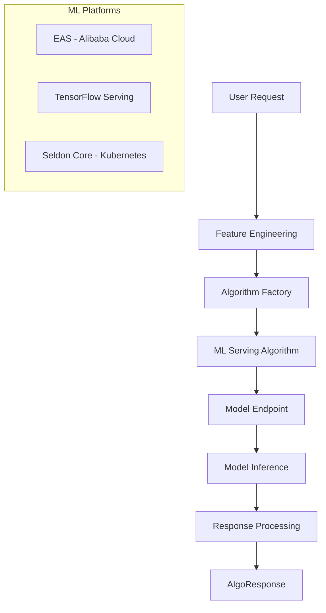

# ML Serving Algorithms

This guide covers PaiRec's machine learning model serving algorithms: **EAS**, **TensorFlow Serving**, and **Seldon**. These algorithms enable real-time inference from trained ML models for recommendation scoring, ranking, and classification.

## Table of Contents
- [ML Serving Overview](#ml-serving-overview)
- [EAS (Elastic Algorithm Service)](#eas-elastic-algorithm-service)
- [TensorFlow Serving](#tensorflow-serving)
- [Seldon Core](#seldon-core)
- [Comparison and Selection Guide](#comparison-and-selection-guide)
- [Configuration Patterns](#configuration-patterns)
- [Use Cases and Examples](#use-cases-and-examples)
- [Performance and Scaling](#performance-and-scaling)
- [Advanced Integration](#advanced-integration)

## ML Serving Overview

### What is ML Serving?

ML serving algorithms integrate trained machine learning models into the recommendation pipeline, enabling real-time inference during recommendation requests. These algorithms handle:

- **Model Inference**: Execute predictions on input features
- **Request/Response Transformation**: Convert between PaiRec data formats and ML model formats
- **Error Handling**: Manage timeouts, retries, and fallback strategies
- **Performance Optimization**: Connection pooling, batching, and caching

### When to Use ML Serving

| ✅ Good For | ❌ Not Good For |
|-------------|-----------------|
| Real-time personalization | Pre-computed static scores |
| Dynamic feature-based scoring | Simple rule-based logic |
| Deep learning models | Basic similarity calculations |
| Complex multi-signal fusion | Fast lookups |
| A/B testing model variants | Simple aggregations |

### ML Serving Architecture



## EAS (Elastic Algorithm Service)

### Overview

**EAS** is Alibaba Cloud's machine learning model serving platform. It supports multiple ML frameworks and provides elastic scaling, high availability, and enterprise-grade features.

**📍 File References**:
- [`algorithm/eas/model.go`](../../algorithm/eas/model.go)
- [`algorithm/eas/`](../../algorithm/eas/) (multiple request/response handlers)

### Supported Processors

EAS supports multiple processor types for different ML frameworks:

| Processor | Description | Use Case |
|-----------|-------------|----------|
| `ALINK_FM` | Factorization Machine models | CTR prediction, feature interaction |
| `PMML` | Predictive Model Markup Language | Traditional ML models |
| `TensorFlow` | TensorFlow models | Deep learning, neural networks |
| `TFServing` | TensorFlow Serving protocol | Production TF models |
| `EasyRec` | Alibaba's recommendation framework | Large-scale recommendation models |
| `Linucb` | Linear contextual bandits | Multi-armed bandit problems |

### Core Components

```go
type EasModel struct {
    retryTimes int           // Number of retry attempts
    name       string        // Algorithm instance name
    request    IEasRequest   // Processor-specific request handler
}

// Different request types for different processors
type IEasRequest interface {
    SetUrl(url string)
    SetAuth(auth map[string]string)
    SetTimeout(timeout int)
    SetResponseFunc(funcName string)
    Invoke(algoData interface{}) (interface{}, error)
}
```

### EAS Configuration

```json
{
  "name": "deep-ranking",
  "type": "EAS",
  "eas_conf": {
    "url": "https://1234567890.cn-beijing.pai-eas.aliyuncs.com/api/predict/ranking_model",
    "processor": "TensorFlow",
    "signature_name": "serving_default",
    "timeout": 1000,
    "retry_times": 2,
    "auth": {
      "Authorization": "Bearer your-token-here"
    },
    "response_func_name": "RankingResponseParser",
    "outputs": ["scores", "embeddings"]
  }
}
```

#### Configuration Fields

| Field | Type | Required | Description |
|-------|------|----------|-------------|
| `url` | `string` | ✅ | EAS model endpoint URL |
| `processor` | `string` | ✅ | Model type: ALINK_FM, PMML, TensorFlow, etc. |
| `timeout` | `int` | ✅ | Request timeout in milliseconds |
| `retry_times` | `int` | ❌ | Number of retry attempts (default: 2) |
| `auth` | `map[string]string` | ❌ | Authentication headers |
| `signature_name` | `string` | ❌ | TensorFlow signature name |
| `outputs` | `[]string` | ❌ | Specific model outputs to return |
| `response_func_name` | `string` | ❌ | Custom response parser function |

### EAS Usage Examples

#### Example 1: TensorFlow Deep Learning Model

```go
package main

import (
    "fmt"
    "log"
    
    "github.com/alibaba/pairec/v2/algorithm"
    "github.com/alibaba/pairec/v2/recconf"
)

func main() {
    // 1. Configure TensorFlow model on EAS
    config := recconf.AlgoConfig{
        Name: "neural-ranker",
        Type: "EAS",
        EasConf: recconf.EasConfig{
            Url:            "https://eas-endpoint.com/api/predict/neural_model",
            Processor:      "TensorFlow",
            SignatureName:  "serving_default",
            Timeout:        800,
            RetryTimes:     3,
            Auth: map[string]string{
                "Authorization": "Bearer eas-token",
            },
            Outputs: []string{"prediction_scores"},
        },
    }
    
    // 2. Initialize
    algorithm.Load(&recconf.RecommendConfig{
        AlgoConfs: []recconf.AlgoConfig{config},
    })
    
    // 3. Prepare input features
    features := map[string]interface{}{
        "user_features": map[string]interface{}{
            "age":        25,
            "gender":     "M",
            "city":       "Beijing",
            "interests":  []string{"tech", "sports"},
        },
        "item_features": []map[string]interface{}{
            {
                "item_id":    "item_1",
                "category":   "electronics", 
                "price":      199.99,
                "ratings":    4.5,
            },
            {
                "item_id":    "item_2",
                "category":   "books",
                "price":      29.99,
                "ratings":    4.2,
            },
        },
        "context_features": map[string]interface{}{
            "hour_of_day":     14,
            "day_of_week":     "Monday",
            "device_type":     "mobile",
        },
    }
    
    // 4. Execute model inference
    result, err := algorithm.Run("neural-ranker", features)
    if err != nil {
        log.Fatalf("EAS inference failed: %v", err)
    }
    
    // 5. Process results
    fmt.Printf("Neural ranking result: %+v\n", result)
}
```

#### Example 2: Factorization Machine (FM) Model

```go
// Configure FM model for CTR prediction
config := recconf.AlgoConfig{
    Name: "ctr-predictor",
    Type: "EAS",
    EasConf: recconf.EasConfig{
        Url:       "https://eas-endpoint.com/api/predict/fm_model",
        Processor: "ALINK_FM",
        Timeout:   500,
    },
}

// Prepare FM input features (sparse format)
fmFeatures := map[string]interface{}{
    "features": []map[string]interface{}{
        {
            "field_id": 1,   // User ID field
            "value":    "user_123",
        },
        {
            "field_id": 2,   // Item category field
            "value":    "electronics",
        },
        {
            "field_id": 3,   // Price range field
            "value":    "100-200",
        },
    },
}

ctrScore, _ := algorithm.Run("ctr-predictor", fmFeatures)
```

#### Example 3: EasyRec Model with Docker Endpoint

```go
// Configure EasyRec model with HTTP endpoint
config := recconf.AlgoConfig{
    Name: "easyrec-ranker",
    Type: "EAS",
    EasConf: recconf.EasConfig{
        Url:          "http://easyrec-service:8080/predict",
        Processor:    "EasyRec",
        EndpointType: eas.EndpointTypeDocker,  // Docker deployment
        Timeout:      1200,
        ResponseFuncName: "EasyRecResponseParser",
    },
}

// EasyRec input format
easyrecInput := map[string]interface{}{
    "user_id": "user_456",
    "item_ids": []string{"item_1", "item_2", "item_3"},
    "features": map[string]interface{}{
        "user_age":      30,
        "user_city":     "Shanghai",
        "item_prices":   []float64{99.9, 199.9, 299.9},
        "item_categories": []string{"tech", "fashion", "home"},
    },
}

rankings, _ := algorithm.Run("easyrec-ranker", easyrecInput)
```

### EAS Advanced Features

#### 1. **Custom Response Processing**
```go
// Register custom response parser
algorithm.RegistRequestDataFunc("custom-eas", func(name string, data interface{}) interface{} {
    // Transform response from EAS model
    if easResponse, ok := data.(map[string]interface{}); ok {
        // Extract and normalize scores
        if scores, ok := easResponse["prediction_scores"].([]float64); ok {
            normalizedScores := make([]float64, len(scores))
            for i, score := range scores {
                normalizedScores[i] = sigmoid(score)  // Apply sigmoid normalization
            }
            easResponse["normalized_scores"] = normalizedScores
        }
    }
    return data
})
```

#### 2. **Multi-Model Ensemble**
```go
// Configure multiple EAS models for ensemble
configs := []recconf.AlgoConfig{
    {Name: "model-v1", Type: "EAS", EasConf: /* config for model v1 */},
    {Name: "model-v2", Type: "EAS", EasConf: /* config for model v2 */},
    {Name: "model-v3", Type: "EAS", EasConf: /* config for model v3 */},
}

// Run ensemble prediction
results := make([]interface{}, len(configs))
for i, config := range configs {
    results[i], _ = algorithm.Run(config.Name, features)
}

// Combine results with weighted average
ensembleScore := combineEnsembleResults(results, weights)
```

## TensorFlow Serving

### Overview

**TensorFlow Serving** is a production-ready serving system for TensorFlow models. It provides high-performance inference with versioning, batching, and monitoring capabilities.

**📍 File References**:
- [`algorithm/tfserving/model.go`](../../algorithm/tfserving/model.go)
- [`algorithm/tfserving/`](../../algorithm/tfserving/)

### Core Components

```go
type TFservingModel struct {
    retryTimes int                 // Retry attempts
    name       string              // Algorithm name
    request    ITFservingRequest   // Request handler
}

type ITFservingRequest interface {
    SetUrl(url string)
    SetTimeout(timeout int)
    SetResponseFunc(funcName string)
    Invoke(algoData interface{}) (interface{}, error)
}
```

### TensorFlow Serving Configuration

```json
{
  "name": "tf-recommender",
  "type": "TFSERVING",
  "tfserving_conf": {
    "url": "http://tf-serving:8501/v1/models/recommender:predict",
    "timeout": 1000,
    "retry_times": 2,
    "response_func_name": "TFServingResponseParser"
  }
}
```

#### Configuration Fields

| Field | Type | Required | Description |
|-------|------|----------|-------------|
| `url` | `string` | ✅ | TensorFlow Serving REST API endpoint |
| `timeout` | `int` | ✅ | Request timeout in milliseconds |
| `retry_times` | `int` | ❌ | Number of retry attempts |
| `response_func_name` | `string` | ❌ | Custom response parser |

### TensorFlow Serving Usage

```go
package main

import (
    "fmt"
    "log"
    
    "github.com/alibaba/pairec/v2/algorithm"
    "github.com/alibaba/pairec/v2/recconf"
)

func main() {
    // 1. Configure TensorFlow Serving
    config := recconf.AlgoConfig{
        Name: "tf-ranking",
        Type: "TFSERVING",
        TFservingConf: recconf.TFservingConfig{
            Url:              "http://tf-serving:8501/v1/models/ranking:predict",
            Timeout:          800,
            RetryTimes:       3,
            ResponseFuncName: "CustomTFResponseParser",
        },
    }
    
    // 2. Initialize
    algorithm.Load(&recconf.RecommendConfig{
        AlgoConfs: []recconf.AlgoConfig{config},
    })
    
    // 3. Prepare TensorFlow Serving request format
    tfRequest := map[string]interface{}{
        "instances": []map[string]interface{}{
            {
                "user_id":     "user_123",
                "item_ids":    []string{"item_1", "item_2"},
                "user_age":    25,
                "item_prices": []float64{19.99, 29.99},
            },
        },
    }
    
    // Alternative: signature-based format
    tfRequestSignature := map[string]interface{}{
        "signature_name": "serving_default",
        "inputs": map[string]interface{}{
            "user_features": [[25, 1, 3]],      // age, gender, city encoded
            "item_features": [[1, 19.99], [2, 29.99]], // category, price
        },
    }
    
    // 4. Execute inference
    result, err := algorithm.Run("tf-ranking", tfRequest)
    if err != nil {
        log.Fatalf("TF Serving failed: %v", err)
    }
    
    // 5. Process TensorFlow output
    if tfResponse, ok := result.(map[string]interface{}); ok {
        if predictions, ok := tfResponse["predictions"].([]interface{}); ok {
            for i, pred := range predictions {
                fmt.Printf("Item %d score: %v\n", i, pred)
            }
        }
    }
}
```

### TensorFlow Serving Features

#### 1. **Model Versioning**
```go
// Request specific model version
tfRequest := map[string]interface{}{
    "model_spec": map[string]interface{}{
        "name": "recommender",
        "version": "3",  // Use version 3 of the model
    },
    "inputs": inputData,
}
```

#### 2. **Batch Prediction**
```go
// Batch multiple instances for efficiency
instances := make([]map[string]interface{}, batchSize)
for i := 0; i < batchSize; i++ {
    instances[i] = map[string]interface{}{
        "user_id":   fmt.Sprintf("user_%d", i),
        "features":  getUserFeatures(i),
    }
}

batchRequest := map[string]interface{}{
    "instances": instances,
}

batchResult, _ := algorithm.Run("tf-batch-ranker", batchRequest)
```

#### 3. **gRPC Integration**
```go
// For high-performance scenarios, configure gRPC endpoint
config := recconf.TFservingConfig{
    Url: "grpc://tf-serving:8500",  // gRPC endpoint
    // ... other config
}
```

## Seldon Core

### Overview

**Seldon Core** is a Kubernetes-native machine learning deployment platform. It provides advanced deployment patterns, A/B testing, and monitoring for ML models.

**📍 File References**:
- [`algorithm/seldon/model.go`](../../algorithm/seldon/model.go)
- [`algorithm/seldon/`](../../algorithm/seldon/)

### Core Components

```go
type Model struct {
    request ISeldonRequest  // Seldon request handler
}

type ISeldonRequest interface {
    SetUrl(url string)
    SetResponseFunc(funcName string)
    Invoke(algoData interface{}) (interface{}, error)
    GetResponseFunc() ResponseFunc
}
```

### Seldon Configuration

```json
{
  "name": "seldon-ensemble",
  "type": "SELDON",
  "seldon_conf": {
    "url": "http://seldon-deployment.seldon:8000/api/v1.0/predictions",
    "response_func_name": "SeldonResponseParser"
  }
}
```

#### Configuration Fields

| Field | Type | Required | Description |
|-------|------|----------|-------------|
| `url` | `string` | ✅ | Seldon deployment prediction endpoint |
| `response_func_name` | `string` | ❌ | Custom response parser function |

### Seldon Usage Examples

#### Example 1: Basic Model Prediction

```go
package main

import (
    "fmt"
    "log"
    
    "github.com/alibaba/pairec/v2/algorithm"
    "github.com/alibaba/pairec/v2/recconf"
)

func main() {
    // 1. Configure Seldon deployment
    config := recconf.AlgoConfig{
        Name: "seldon-ranker",
        Type: "SELDON",
        SeldonConf: recconf.SeldonConfig{
            Url: "http://recommendation-model.seldon:8000/api/v1.0/predictions",
            ResponseFuncName: "SeldonRankingParser",
        },
    }
    
    // 2. Initialize
    algorithm.Load(&recconf.RecommendConfig{
        AlgoConfs: []recconf.AlgoConfig{config},
    })
    
    // 3. Prepare Seldon request format
    seldonRequest := map[string]interface{}{
        "data": map[string]interface{}{
            "ndarray": [][]float64{
                {1.0, 2.0, 3.0},  // User features
                {4.0, 5.0, 6.0},  // Item features
            },
        },
        "meta": map[string]interface{}{
            "user_id": "user_123",
            "context": "homepage",
        },
    }
    
    // 4. Execute prediction
    result, err := algorithm.Run("seldon-ranker", seldonRequest)
    if err != nil {
        log.Fatalf("Seldon prediction failed: %v", err)
    }
    
    // 5. Process Seldon response
    fmt.Printf("Seldon prediction: %+v\n", result)
}
```

#### Example 2: Multi-Armed Bandit with Seldon

```go
// Configure Seldon deployment with multi-armed bandit
config := recconf.AlgoConfig{
    Name: "bandit-optimizer",
    Type: "SELDON",
    SeldonConf: recconf.SeldonConfig{
        Url: "http://bandit-model.seldon:8000/api/v1.0/predictions",
    },
}

// Prepare bandit context
banditRequest := map[string]interface{}{
    "data": map[string]interface{}{
        "ndarray": [][]float64{{
            userAge, userIncome, userLocation,  // User context
            itemPrice, itemCategory, itemRating, // Item context
        }},
    },
    "meta": map[string]interface{}{
        "routing": map[string]interface{}{
            "epsilon": 0.1,  // Exploration rate
        },
    },
}

banditResult, _ := algorithm.Run("bandit-optimizer", banditRequest)
```

### Seldon Advanced Features

#### 1. **A/B Testing Integration**
```go
// Seldon can handle A/B testing at the deployment level
seldonRequest := map[string]interface{}{
    "data": inputData,
    "meta": map[string]interface{}{
        "routing": map[string]interface{}{
            "variant": "model-v2",  // Route to specific model variant
        },
    },
}
```

#### 2. **Ensemble Models**
```go
// Seldon can orchestrate ensemble predictions
ensembleRequest := map[string]interface{}{
    "data": inputData,
    "meta": map[string]interface{}{
        "ensemble": map[string]interface{}{
            "combiner": "weighted_average",
            "weights":  []float64{0.6, 0.4}, // Model weights
        },
    },
}
```

## Comparison and Selection Guide

### Feature Comparison

| Feature | EAS | TensorFlow Serving | Seldon Core |
|---------|-----|-------------------|-------------|
| **Cloud Integration** | Alibaba Cloud native | Cloud agnostic | Kubernetes native |
| **Framework Support** | Multi-framework | TensorFlow focused | Framework agnostic |
| **Deployment** | Managed service | Container/VM | Kubernetes operator |
| **Scaling** | Auto-scaling | Manual/K8s scaling | Kubernetes scaling |
| **A/B Testing** | Basic | None | Advanced |
| **Monitoring** | Cloud monitoring | Basic metrics | Rich Prometheus metrics |
| **Cost** | Pay-per-use | Infrastructure cost | Infrastructure cost |

### Performance Characteristics

| Metric | EAS | TensorFlow Serving | Seldon Core |
|--------|-----|-------------------|-------------|
| **Latency** | 5-50ms | 1-20ms | 10-100ms |
| **Throughput** | Very High | Very High | High |
| **Setup Time** | Minutes | Hours | Hours |
| **Operational Overhead** | Very Low | Medium | Medium-High |

### Selection Guidelines

#### Choose EAS When:
- **Using Alibaba Cloud** infrastructure
- **Need managed ML serving** with minimal operations
- **Multi-framework models** (TF, PyTorch, PMML, etc.)
- **Quick deployment** is priority
- **Pay-per-use pricing** is preferred

#### Choose TensorFlow Serving When:
- **TensorFlow models** exclusively
- **Maximum performance** required
- **Full control** over infrastructure
- **Custom optimization** needed
- **On-premises deployment** required

#### Choose Seldon Core When:
- **Kubernetes infrastructure** already in place
- **Advanced deployment patterns** needed (A/B testing, canary)
- **Multi-framework support** required
- **MLOps workflows** with GitOps
- **Complex model pipelines** (preprocessing, ensemble, postprocessing)

## Configuration Patterns

### Environment-Based Configuration

#### Development Environment
```json
{
  "algo_confs": [
    {
      "name": "dev-model",
      "type": "TFSERVING",
      "tfserving_conf": {
        "url": "http://localhost:8501/v1/models/test:predict",
        "timeout": 2000,
        "retry_times": 1
      }
    }
  ]
}
```

#### Staging Environment
```json
{
  "algo_confs": [
    {
      "name": "staging-model",
      "type": "SELDON",
      "seldon_conf": {
        "url": "http://staging-model.seldon.svc.cluster.local:8000/api/v1.0/predictions"
      }
    }
  ]
}
```

#### Production Environment
```json
{
  "algo_confs": [
    {
      "name": "prod-model",
      "type": "EAS",
      "eas_conf": {
        "url": "https://prod-model.cn-beijing.pai-eas.aliyuncs.com/api/predict/ranking",
        "processor": "TensorFlow",
        "timeout": 500,
        "retry_times": 3,
        "auth": {
          "Authorization": "Bearer ${EAS_TOKEN}"
        }
      }
    }
  ]
}
```

### Multi-Model Configuration

Use different algorithms for different purposes:

```json
{
  "algo_confs": [
    {
      "name": "ranking-model",
      "type": "EAS",
      "eas_conf": {
        "url": "https://ranking-model.eas.com/predict",
        "processor": "TensorFlow"
      }
    },
    {
      "name": "ctr-model",
      "type": "TFSERVING",
      "tfserving_conf": {
        "url": "http://ctr-model:8501/v1/models/ctr:predict"
      }
    },
    {
      "name": "bandit-model",
      "type": "SELDON",
      "seldon_conf": {
        "url": "http://bandit.seldon:8000/api/v1.0/predictions"
      }
    }
  ]
}
```

## Use Cases and Examples

### Use Case 1: Real-time Personalization

**Scenario**: E-commerce platform providing personalized product rankings.

```go
// Configure deep learning ranking model
config := recconf.AlgoConfig{
    Name: "personalized-ranking",
    Type: "EAS",
    EasConf: recconf.EasConfig{
        Url:       "https://ranking-model.eas.com/predict",
        Processor: "TensorFlow",
        Timeout:   300,
    },
}

// User and context features
features := map[string]interface{}{
    "user_id":           "user_123",
    "user_profile":      getUserProfile("user_123"),
    "candidate_items":   getCandidateItems("user_123"),
    "context_features":  getCurrentContext(),
}

// Get personalized rankings
rankings, _ := algorithm.Run("personalized-ranking", features)
```

### Use Case 2: CTR Prediction

**Scenario**: Ad platform predicting click-through rates for ad targeting.

```go
// Configure CTR prediction model
config := recconf.AlgoConfig{
    Name: "ctr-predictor",
    Type: "TFSERVING",
    TFservingConf: recconf.TFservingConfig{
        Url: "http://ctr-model:8501/v1/models/ctr:predict",
        Timeout: 200,  // Fast response for ad serving
    },
}

// Ad serving features
adFeatures := map[string]interface{}{
    "instances": []map[string]interface{}{
        {
            "user_demographics": []float64{25, 1, 2},  // age, gender, location
            "ad_features":       []float64{1, 0, 1},  // category, format, placement
            "context":           []float64{14, 1, 3}, // hour, weekday, device
        },
    },
}

ctrPrediction, _ := algorithm.Run("ctr-predictor", adFeatures)
```

### Use Case 3: Multi-Armed Bandit Optimization

**Scenario**: Content platform optimizing article recommendations using exploration.

```go
// Configure bandit model with Seldon
config := recconf.AlgoConfig{
    Name: "content-bandit",
    Type: "SELDON",
    SeldonConf: recconf.SeldonConfig{
        Url: "http://bandit-model.seldon:8000/api/v1.0/predictions",
    },
}

// Bandit context
banditContext := map[string]interface{}{
    "data": map[string]interface{}{
        "ndarray": [][]float64{{
            userEngagement, userTopics, timeOfDay,     // User context
            articleAge, articlePopularity, articleTopic, // Article context
        }},
    },
    "meta": map[string]interface{}{
        "user_id": "user_123",
        "session_id": "session_456",
    },
}

recommendation, _ := algorithm.Run("content-bandit", banditContext)
```

### Use Case 4: Ensemble Model Integration

**Scenario**: Combining multiple models for improved accuracy.

```go
// Configure multiple models
configs := []recconf.AlgoConfig{
    {Name: "collaborative-model", Type: "EAS", EasConf: /* CF model */},
    {Name: "content-model", Type: "TFSERVING", TFservingConf: /* content model */},
    {Name: "popularity-model", Type: "SELDON", SeldonConf: /* popularity model */},
}

// Run ensemble prediction
func ensemblePrediction(userID string, items []string) []float64 {
    // Get predictions from all models
    cfScores, _ := algorithm.Run("collaborative-model", cfFeatures)
    contentScores, _ := algorithm.Run("content-model", contentFeatures)
    popularityScores, _ := algorithm.Run("popularity-model", popularityFeatures)
    
    // Combine with weighted average
    weights := []float64{0.5, 0.3, 0.2}
    return combineScores([]interface{}{cfScores, contentScores, popularityScores}, weights)
}
```

## Performance and Scaling

### Performance Optimization

#### 1. **Timeout Tuning**
```json
{
  "eas_conf": {
    "timeout": 300      // Fast models: 100-500ms
  },
  "tfserving_conf": {
    "timeout": 800      // Complex models: 500-2000ms
  },
  "seldon_conf": {
    "timeout": 1500     // Ensemble models: 1000-3000ms
  }
}
```

#### 2. **Retry Strategy**
```json
{
  "eas_conf": {
    "retry_times": 2,   // Balance between reliability and latency
    "timeout": 400      // Shorter timeout with retries
  }
}
```

#### 3. **Batch Processing**
```go
// Batch multiple predictions for efficiency
batchFeatures := map[string]interface{}{
    "instances": []map[string]interface{}{
        userFeatures1, userFeatures2, userFeatures3,
    },
}

batchResults, _ := algorithm.Run("batch-model", batchFeatures)
```

### Scaling Strategies

#### 1. **Horizontal Scaling**
```yaml
# Kubernetes deployment scaling
apiVersion: apps/v1
kind: Deployment
metadata:
  name: tf-serving
spec:
  replicas: 5  # Scale based on load
  template:
    spec:
      containers:
      - name: tf-serving
        image: tensorflow/serving
        resources:
          requests:
            memory: "1Gi"
            cpu: "500m"
          limits:
            memory: "2Gi"
            cpu: "1"
```

#### 2. **Auto-scaling Configuration**
```json
{
  "eas_conf": {
    "url": "https://auto-scaling-endpoint.eas.com",
    "auto_scaling": {
      "min_instances": 2,
      "max_instances": 20,
      "target_cpu": 70
    }
  }
}
```

#### 3. **Load Balancing**
```go
// Multiple endpoints for load distribution
easEndpoints := []string{
    "https://model-1.eas.com/predict",
    "https://model-2.eas.com/predict", 
    "https://model-3.eas.com/predict",
}

// Round-robin or weighted distribution
endpoint := selectEndpoint(easEndpoints, loadBalancingStrategy)
```

## Advanced Integration

### Custom Response Processing

```go
// Register sophisticated response parser
algorithm.RegistRequestDataFunc("advanced-eas", func(name string, data interface{}) interface{} {
    if response, ok := data.(map[string]interface{}); ok {
        // Extract multiple outputs
        scores := response["scores"].([]float64)
        embeddings := response["embeddings"].([][]float64)
        explanations := response["explanations"].([]string)
        
        // Create structured response
        return map[string]interface{}{
            "predictions": scores,
            "features":    embeddings,
            "reasons":     explanations,
            "metadata": map[string]interface{}{
                "model_version": response["model_version"],
                "inference_time": response["latency_ms"],
            },
        }
    }
    return data
})
```

### Model Version Management

```go
// Dynamic model version switching
func switchModelVersion(modelName string, newVersion string) {
    newConfig := recconf.AlgoConfig{
        Name: modelName,
        Type: "TFSERVING",
        TFservingConf: recconf.TFservingConfig{
            Url: fmt.Sprintf("http://tf-serving:8501/v1/models/%s/versions/%s:predict", 
                modelName, newVersion),
        },
    }
    
    // Hot swap algorithm configuration
    algorithm.AddAlgoWithSign(newConfig)
}
```

### Error Handling and Fallbacks

```go
// Implement fallback strategy
func robustPrediction(features interface{}) interface{} {
    // Try primary model
    result, err := algorithm.Run("primary-model", features)
    if err == nil {
        return result
    }
    
    // Fallback to secondary model
    result, err = algorithm.Run("fallback-model", features)
    if err == nil {
        return result
    }
    
    // Final fallback to rule-based scoring
    return algorithm.Run("rule-based-fallback", features)
}
```

---

## Summary

ML serving algorithms in PaiRec enable powerful real-time personalization through:

- **EAS integration** for Alibaba Cloud managed ML serving
- **TensorFlow Serving** for high-performance TensorFlow model deployment
- **Seldon Core** for Kubernetes-native ML workflows with advanced features
- **Flexible configuration** supporting multiple deployment patterns
- **Production-ready features** including retries, timeouts, and error handling

### Key Takeaways

1. **EAS provides managed, multi-framework ML serving** with minimal operational overhead
2. **TensorFlow Serving excels in high-performance TensorFlow deployments**
3. **Seldon Core offers advanced MLOps features** for Kubernetes environments
4. **Choose based on infrastructure, requirements, and operational preferences**
5. **All platforms integrate seamlessly** with PaiRec's algorithm framework

### Next Steps

- **[Response Handling](06-response-handling.md)** - Process and combine ML model outputs
- **[Configuration Guide](07-configuration.md)** - Master advanced configuration patterns
- **[Performance Optimization](09-performance.md)** - Production tuning and scaling strategies
- **[Custom Algorithms](08-custom-algorithms.md)** - Build custom ML serving integrations