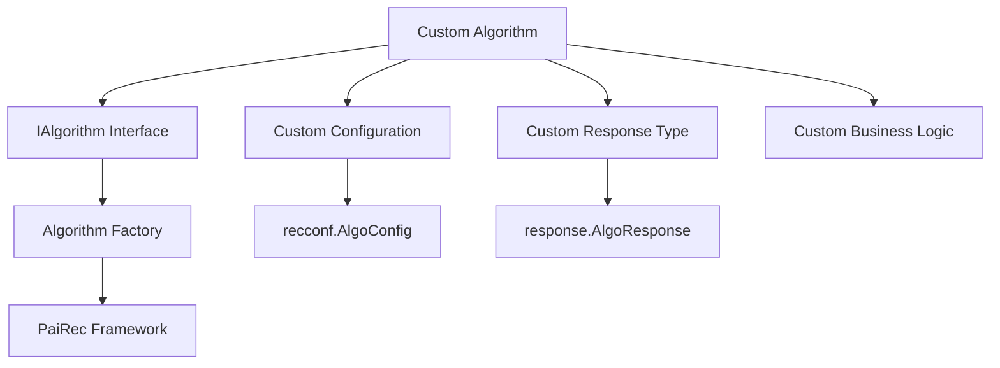

# Custom Algorithms

This guide shows how to build, integrate, and deploy custom algorithms in PaiRec. Learn to extend the framework with your own algorithm implementations while maintaining compatibility with the existing ecosystem.

## Table of Contents
- [Custom Algorithm Overview](#custom-algorithm-overview)
- [Implementing IAlgorithm Interface](#implementing-ialgorithm-interface)
- [Creating Custom Response Types](#creating-custom-response-types)
- [Integrating with Algorithm Factory](#integrating-with-algorithm-factory)
- [Configuration and Deployment](#configuration-and-deployment)
- [Testing Custom Algorithms](#testing-custom-algorithms)
- [Advanced Integration Patterns](#advanced-integration-patterns)
- [Production Considerations](#production-considerations)

## Custom Algorithm Overview

### Why Build Custom Algorithms?

While PaiRec provides comprehensive built-in algorithms, you may need custom implementations for:

- **Proprietary ML models** not supported by standard serving platforms
- **Business-specific logic** that combines multiple signals
- **Hybrid algorithms** that integrate external APIs or services
- **Performance-optimized implementations** for specific use cases
- **Legacy system integration** with existing recommendation engines

### Custom Algorithm Architecture



### Development Workflow

1. **Design**: Define algorithm purpose, inputs, and outputs
2. **Implement**: Create algorithm struct implementing IAlgorithm
3. **Configure**: Define configuration structure and validation
4. **Test**: Write unit and integration tests
5. **Integrate**: Register with algorithm factory
6. **Deploy**: Package and deploy with PaiRec

## Implementing IAlgorithm Interface

### Basic Interface Requirements

Every custom algorithm must implement the `IAlgorithm` interface:

```go
type IAlgorithm interface {
    Init(conf *recconf.AlgoConfig) error
    Run(algoData interface{}) (interface{}, error)
}
```

### Example: Simple Custom Algorithm

Let's create a "WeightedScore" algorithm that combines multiple features:

```go
package custom

import (
    "fmt"
    "math"
    
    "github.com/alibaba/pairec/v2/algorithm/response"
    "github.com/alibaba/pairec/v2/recconf"
)

// WeightedScoreAlgorithm combines multiple features with weights
type WeightedScoreAlgorithm struct {
    name    string
    config  *WeightedScoreConfig
}

// Configuration for weighted scoring
type WeightedScoreConfig struct {
    Weights      map[string]float64 `json:"weights"`       // feature -> weight
    DefaultScore float64            `json:"default_score"` // fallback score
    Normalize    bool               `json:"normalize"`     // whether to normalize
}

// Response type for weighted scoring
type WeightedScoreResponse struct {
    score       float64
    featureMap  map[string]float64
    finalScore  float64
}

func (r *WeightedScoreResponse) GetScore() float64 {
    return r.finalScore
}

func (r *WeightedScoreResponse) GetScoreMap() map[string]float64 {
    scoreMap := make(map[string]float64)
    for feature, score := range r.featureMap {
        scoreMap[feature] = score
    }
    scoreMap["weighted_final"] = r.finalScore
    return scoreMap
}

func (r *WeightedScoreResponse) GetModuleType() bool {
    return true  // Custom algorithm
}

// Constructor
func NewWeightedScoreAlgorithm(name string) *WeightedScoreAlgorithm {
    return &WeightedScoreAlgorithm{
        name: name,
    }
}

// Initialize algorithm with configuration
func (w *WeightedScoreAlgorithm) Init(conf *recconf.AlgoConfig) error {
    // Extract custom configuration from AlgoConfig
    customConf, err := w.parseConfiguration(conf)
    if err != nil {
        return fmt.Errorf("failed to parse WeightedScore config: %v", err)
    }
    
    // Validate configuration
    if err := w.validateConfiguration(customConf); err != nil {
        return fmt.Errorf("invalid WeightedScore config: %v", err)
    }
    
    w.config = customConf
    return nil
}

// Run algorithm on input data
func (w *WeightedScoreAlgorithm) Run(algoData interface{}) (interface{}, error) {
    // Type assertion for input data
    featureList, ok := algoData.([]map[string]interface{})
    if !ok {
        return nil, fmt.Errorf("WeightedScore expects []map[string]interface{}, got %T", algoData)
    }
    
    results := make([]response.AlgoResponse, len(featureList))
    
    for i, features := range featureList {
        score := w.computeWeightedScore(features)
        
        results[i] = &WeightedScoreResponse{
            score:       score,
            featureMap:  w.extractFeatureScores(features),
            finalScore:  score,
        }
    }
    
    return results, nil
}

// Parse custom configuration from standard AlgoConfig
func (w *WeightedScoreAlgorithm) parseConfiguration(conf *recconf.AlgoConfig) (*WeightedScoreConfig, error) {
    // For custom algorithms, configuration is typically in UserDefineConfs
    // or added as a new field to AlgoConfig
    
    // Method 1: Using custom field (requires modifying recconf.AlgoConfig)
    // return &conf.WeightedScoreConf, nil
    
    // Method 2: Using UserDefineConfs (more flexible)
    if conf.UserDefineConfs == nil {
        return nil, fmt.Errorf("no custom configuration found")
    }
    
    var customConf WeightedScoreConfig
    if err := json.Unmarshal(conf.UserDefineConfs, &customConf); err != nil {
        return nil, err
    }
    
    return &customConf, nil
}

// Validate custom configuration
func (w *WeightedScoreAlgorithm) validateConfiguration(config *WeightedScoreConfig) error {
    if len(config.Weights) == 0 {
        return fmt.Errorf("at least one weight must be specified")
    }
    
    totalWeight := 0.0
    for feature, weight := range config.Weights {
        if weight < 0 {
            return fmt.Errorf("negative weight for feature %s: %f", feature, weight)
        }
        totalWeight += weight
    }
    
    if totalWeight == 0 {
        return fmt.Errorf("total weight cannot be zero")
    }
    
    return nil
}

// Compute weighted score from features
func (w *WeightedScoreAlgorithm) computeWeightedScore(features map[string]interface{}) float64 {
    var weightedSum float64
    var totalWeight float64
    
    for feature, weight := range w.config.Weights {
        if value, exists := features[feature]; exists {
            if score, ok := value.(float64); ok {
                weightedSum += score * weight
                totalWeight += weight
            }
        }
    }
    
    if totalWeight == 0 {
        return w.config.DefaultScore
    }
    
    finalScore := weightedSum / totalWeight
    
    // Normalize if configured
    if w.config.Normalize {
        finalScore = w.normalize(finalScore)
    }
    
    return finalScore
}

// Extract individual feature scores
func (w *WeightedScoreAlgorithm) extractFeatureScores(features map[string]interface{}) map[string]float64 {
    scoreMap := make(map[string]float64)
    
    for feature := range w.config.Weights {
        if value, exists := features[feature]; exists {
            if score, ok := value.(float64); ok {
                scoreMap[feature] = score
            }
        }
    }
    
    return scoreMap
}

// Normalize score to [0, 1] range using sigmoid
func (w *WeightedScoreAlgorithm) normalize(score float64) float64 {
    return 1.0 / (1.0 + math.Exp(-score))
}
```

### Advanced Custom Algorithm Example

Here's a more sophisticated example that integrates with external services:

```go
package custom

import (
    "context"
    "encoding/json"
    "fmt"
    "net/http"
    "time"
    
    "github.com/alibaba/pairec/v2/algorithm/response"
    "github.com/alibaba/pairec/v2/recconf"
)

// HybridAPIAlgorithm calls external API and combines with local computation
type HybridAPIAlgorithm struct {
    name       string
    config     *HybridAPIConfig
    httpClient *http.Client
}

type HybridAPIConfig struct {
    APIEndpoint    string            `json:"api_endpoint"`
    APIKey         string            `json:"api_key"`
    Timeout        int               `json:"timeout"`
    LocalWeights   map[string]float64 `json:"local_weights"`
    APIWeight      float64           `json:"api_weight"`
    FallbackScore  float64           `json:"fallback_score"`
    MaxRetries     int               `json:"max_retries"`
}

type HybridAPIResponse struct {
    apiScore    float64
    localScore  float64
    finalScore  float64
    metadata    map[string]interface{}
}

func (r *HybridAPIResponse) GetScore() float64 {
    return r.finalScore
}

func (r *HybridAPIResponse) GetScoreMap() map[string]float64 {
    return map[string]float64{
        "api_score":   r.apiScore,
        "local_score": r.localScore,
        "final_score": r.finalScore,
    }
}

func (r *HybridAPIResponse) GetModuleType() bool {
    return true
}

func NewHybridAPIAlgorithm(name string) *HybridAPIAlgorithm {
    return &HybridAPIAlgorithm{
        name: name,
    }
}

func (h *HybridAPIAlgorithm) Init(conf *recconf.AlgoConfig) error {
    // Parse configuration
    var config HybridAPIConfig
    if err := json.Unmarshal(conf.UserDefineConfs, &config); err != nil {
        return fmt.Errorf("failed to parse HybridAPI config: %v", err)
    }
    
    // Validate configuration
    if config.APIEndpoint == "" {
        return fmt.Errorf("API endpoint is required")
    }
    if config.Timeout <= 0 {
        config.Timeout = 1000 // Default 1 second
    }
    
    h.config = &config
    
    // Initialize HTTP client
    h.httpClient = &http.Client{
        Timeout: time.Duration(config.Timeout) * time.Millisecond,
    }
    
    return nil
}

func (h *HybridAPIAlgorithm) Run(algoData interface{}) (interface{}, error) {
    featureList, ok := algoData.([]map[string]interface{})
    if !ok {
        return nil, fmt.Errorf("HybridAPI expects []map[string]interface{}")
    }
    
    results := make([]response.AlgoResponse, len(featureList))
    
    for i, features := range featureList {
        // Compute local score
        localScore := h.computeLocalScore(features)
        
        // Get API score with retries
        apiScore := h.getAPIScoreWithRetry(features)
        
        // Combine scores
        finalScore := h.combineScores(localScore, apiScore)
        
        results[i] = &HybridAPIResponse{
            apiScore:   apiScore,
            localScore: localScore,
            finalScore: finalScore,
            metadata: map[string]interface{}{
                "item_id":    features["item_id"],
                "timestamp":  time.Now().Unix(),
                "algorithm":  h.name,
            },
        }
    }
    
    return results, nil
}

func (h *HybridAPIAlgorithm) computeLocalScore(features map[string]interface{}) float64 {
    var weightedSum float64
    var totalWeight float64
    
    for feature, weight := range h.config.LocalWeights {
        if value, exists := features[feature]; exists {
            if score, ok := value.(float64); ok {
                weightedSum += score * weight
                totalWeight += weight
            }
        }
    }
    
    if totalWeight == 0 {
        return h.config.FallbackScore
    }
    
    return weightedSum / totalWeight
}

func (h *HybridAPIAlgorithm) getAPIScoreWithRetry(features map[string]interface{}) float64 {
    maxRetries := h.config.MaxRetries
    if maxRetries <= 0 {
        maxRetries = 2
    }
    
    for attempt := 0; attempt <= maxRetries; attempt++ {
        score, err := h.callExternalAPI(features)
        if err == nil {
            return score
        }
        
        if attempt == maxRetries {
            // Final attempt failed, use fallback
            return h.config.FallbackScore
        }
        
        // Wait before retry
        time.Sleep(time.Duration(attempt*100) * time.Millisecond)
    }
    
    return h.config.FallbackScore
}

func (h *HybridAPIAlgorithm) callExternalAPI(features map[string]interface{}) (float64, error) {
    // Prepare API request
    requestData := map[string]interface{}{
        "features": features,
    }
    
    requestBody, err := json.Marshal(requestData)
    if err != nil {
        return 0, err
    }
    
    // Create HTTP request
    req, err := http.NewRequest("POST", h.config.APIEndpoint, bytes.NewBuffer(requestBody))
    if err != nil {
        return 0, err
    }
    
    req.Header.Set("Content-Type", "application/json")
    req.Header.Set("Authorization", "Bearer "+h.config.APIKey)
    
    // Execute request
    resp, err := h.httpClient.Do(req)
    if err != nil {
        return 0, err
    }
    defer resp.Body.Close()
    
    if resp.StatusCode != http.StatusOK {
        return 0, fmt.Errorf("API returned status %d", resp.StatusCode)
    }
    
    // Parse response
    var apiResponse struct {
        Score float64 `json:"score"`
    }
    
    if err := json.NewDecoder(resp.Body).Decode(&apiResponse); err != nil {
        return 0, err
    }
    
    return apiResponse.Score, nil
}

func (h *HybridAPIAlgorithm) combineScores(localScore, apiScore float64) float64 {
    localWeight := 1.0 - h.config.APIWeight
    return localScore*localWeight + apiScore*h.config.APIWeight
}
```

## Creating Custom Response Types

### Simple Response Type

```go
type CustomScoreResponse struct {
    primaryScore    float64
    confidence     float64
    explanation    string
}

func (r *CustomScoreResponse) GetScore() float64 {
    return r.primaryScore
}

func (r *CustomScoreResponse) GetScoreMap() map[string]float64 {
    return map[string]float64{
        "primary":    r.primaryScore,
        "confidence": r.confidence,
    }
}

func (r *CustomScoreResponse) GetModuleType() bool {
    return true
}

// Custom method for explanation
func (r *CustomScoreResponse) GetExplanation() string {
    return r.explanation
}
```

### Multi-Classification Response

```go
type CustomClassifierResponse struct {
    topClass       string
    confidence     float64
    classProbas    map[string][]float64
    featureImportance map[string]float64
}

func (r *CustomClassifierResponse) GetScore() float64 {
    return r.confidence
}

func (r *CustomClassifierResponse) GetScoreMap() map[string]float64 {
    scoreMap := make(map[string]float64)
    scoreMap["confidence"] = r.confidence
    
    // Add feature importance scores
    for feature, importance := range r.featureImportance {
        scoreMap["feature_"+feature] = importance
    }
    
    return scoreMap
}

func (r *CustomClassifierResponse) GetModuleType() bool {
    return true
}

// Implement multi-classification interface
func (r *CustomClassifierResponse) GetClassifyMap() map[string][]float64 {
    return r.classProbas
}

// Custom methods
func (r *CustomClassifierResponse) GetTopClass() string {
    return r.topClass
}

func (r *CustomClassifierResponse) GetFeatureImportance() map[string]float64 {
    return r.featureImportance
}
```

## Integrating with Algorithm Factory

### Method 1: Modify Algorithm Factory

Add your custom algorithm to the factory switch statement:

```go
// In algorithm/algorithm.go, modify initAlgo function
func (a *AlgorithmFactory) initAlgo(conf recconf.AlgoConfig) (IAlgorithm, error) {
    var algo IAlgorithm
    
    switch conf.Type {
    case "EAS":
        algo = eas.NewEasModel(conf.Name)
    case "FAISS":
        algo = faiss.NewFaissModel(conf.Name)
    // ... existing cases ...
    
    // Add custom algorithm types
    case "WEIGHTED_SCORE":
        algo = custom.NewWeightedScoreAlgorithm(conf.Name)
    case "HYBRID_API":
        algo = custom.NewHybridAPIAlgorithm(conf.Name)
    default:
        return nil, fmt.Errorf("algorithm type not support, type:%s", conf.Type)
    }
    
    err := algo.Init(&conf)
    if err != nil {
        return nil, fmt.Errorf("init algorithm error, name:%s, err:%v", conf.Name, err)
    }
    
    return algo, nil
}
```

### Method 2: Plugin Registration

Create a plugin system for dynamic registration:

```go
package algorithm

var customAlgorithmRegistry = make(map[string]func(string) IAlgorithm)

// RegisterCustomAlgorithm allows plugins to register new algorithm types
func RegisterCustomAlgorithm(algorithmType string, constructor func(string) IAlgorithm) {
    customAlgorithmRegistry[algorithmType] = constructor
}

// Modified initAlgo to support custom algorithms
func (a *AlgorithmFactory) initAlgo(conf recconf.AlgoConfig) (IAlgorithm, error) {
    var algo IAlgorithm
    
    // Check built-in algorithms first
    switch conf.Type {
    case "EAS":
        algo = eas.NewEasModel(conf.Name)
    // ... other built-in types ...
    default:
        // Check custom algorithm registry
        if constructor, exists := customAlgorithmRegistry[conf.Type]; exists {
            algo = constructor(conf.Name)
        } else {
            return nil, fmt.Errorf("algorithm type not support, type:%s", conf.Type)
        }
    }
    
    err := algo.Init(&conf)
    if err != nil {
        return nil, fmt.Errorf("init algorithm error, name:%s, err:%v", conf.Name, err)
    }
    
    return algo, nil
}
```

Register custom algorithms:

```go
package main

import (
    "github.com/alibaba/pairec/v2/algorithm"
    "your-company/pairec-custom/algorithms"
)

func init() {
    // Register custom algorithms
    algorithm.RegisterCustomAlgorithm("WEIGHTED_SCORE", 
        func(name string) algorithm.IAlgorithm {
            return algorithms.NewWeightedScoreAlgorithm(name)
        })
    
    algorithm.RegisterCustomAlgorithm("HYBRID_API",
        func(name string) algorithm.IAlgorithm {
            return algorithms.NewHybridAPIAlgorithm(name)
        })
}
```

## Configuration and Deployment

### Custom Configuration Structure

Extend the AlgoConfig structure:

```go
// Option 1: Add to existing AlgoConfig (requires modifying recconf package)
type AlgoConfig struct {
    Name              string
    Type              string
    // ... existing fields ...
    
    // Custom algorithm configurations
    WeightedScoreConf WeightedScoreConfig `json:"weighted_score_conf"`
    HybridAPIConf     HybridAPIConfig     `json:"hybrid_api_conf"`
}

// Option 2: Use UserDefineConfs (recommended for external algorithms)
type AlgoConfig struct {
    Name            string
    Type            string
    // ... existing fields ...
    UserDefineConfs json.RawMessage `json:"user_define_confs"`
}
```

### Configuration Examples

#### WeightedScore Configuration
```json
{
  "algo_confs": [
    {
      "name": "content-weighted-scorer",
      "type": "WEIGHTED_SCORE",
      "user_define_confs": {
        "weights": {
          "relevance": 0.4,
          "popularity": 0.3,
          "freshness": 0.2,
          "quality": 0.1
        },
        "default_score": 0.5,
        "normalize": true
      }
    }
  ]
}
```

#### HybridAPI Configuration
```json
{
  "algo_confs": [
    {
      "name": "hybrid-ranker",
      "type": "HYBRID_API",
      "user_define_confs": {
        "api_endpoint": "https://ml-api.company.com/score",
        "api_key": "${ML_API_KEY}",
        "timeout": 800,
        "local_weights": {
          "ctr": 0.6,
          "cvr": 0.4
        },
        "api_weight": 0.7,
        "fallback_score": 0.5,
        "max_retries": 2
      }
    }
  ]
}
```

## Testing Custom Algorithms

### Unit Tests

```go
package custom

import (
    "testing"
    "encoding/json"
    
    "github.com/alibaba/pairec/v2/recconf"
    "github.com/stretchr/testify/assert"
)

func TestWeightedScoreAlgorithm(t *testing.T) {
    // Test configuration
    config := WeightedScoreConfig{
        Weights: map[string]float64{
            "relevance": 0.6,
            "popularity": 0.4,
        },
        DefaultScore: 0.5,
        Normalize:    false,
    }
    
    configJSON, _ := json.Marshal(config)
    algoConfig := recconf.AlgoConfig{
        Name:            "test-weighted",
        Type:            "WEIGHTED_SCORE",
        UserDefineConfs: configJSON,
    }
    
    // Test initialization
    algo := NewWeightedScoreAlgorithm("test-weighted")
    err := algo.Init(&algoConfig)
    assert.NoError(t, err)
    
    // Test execution
    inputData := []map[string]interface{}{
        {
            "item_id":    "item1",
            "relevance":  0.8,
            "popularity": 0.6,
        },
        {
            "item_id":    "item2",
            "relevance":  0.9,
            "popularity": 0.4,
        },
    }
    
    result, err := algo.Run(inputData)
    assert.NoError(t, err)
    
    responses, ok := result.([]response.AlgoResponse)
    assert.True(t, ok)
    assert.Len(t, responses, 2)
    
    // Test scores
    assert.InDelta(t, 0.72, responses[0].GetScore(), 0.01) // 0.8*0.6 + 0.6*0.4 = 0.72
    assert.InDelta(t, 0.70, responses[1].GetScore(), 0.01) // 0.9*0.6 + 0.4*0.4 = 0.70
}

func TestWeightedScoreAlgorithm_MissingFeatures(t *testing.T) {
    config := WeightedScoreConfig{
        Weights: map[string]float64{
            "relevance": 0.6,
            "popularity": 0.4,
        },
        DefaultScore: 0.5,
    }
    
    configJSON, _ := json.Marshal(config)
    algoConfig := recconf.AlgoConfig{
        Name:            "test-missing",
        Type:            "WEIGHTED_SCORE",
        UserDefineConfs: configJSON,
    }
    
    algo := NewWeightedScoreAlgorithm("test-missing")
    algo.Init(&algoConfig)
    
    // Test with missing features
    inputData := []map[string]interface{}{
        {
            "item_id": "item1",
            // Missing both relevance and popularity
        },
    }
    
    result, err := algo.Run(inputData)
    assert.NoError(t, err)
    
    responses, ok := result.([]response.AlgoResponse)
    assert.True(t, ok)
    assert.Equal(t, 0.5, responses[0].GetScore()) // Should use default score
}
```

### Integration Tests

```go
func TestCustomAlgorithmIntegration(t *testing.T) {
    // Register custom algorithm
    algorithm.RegisterCustomAlgorithm("WEIGHTED_SCORE", 
        func(name string) algorithm.IAlgorithm {
            return NewWeightedScoreAlgorithm(name)
        })
    
    // Load configuration
    config := &recconf.RecommendConfig{
        AlgoConfs: []recconf.AlgoConfig{
            {
                Name: "integration-test",
                Type: "WEIGHTED_SCORE",
                UserDefineConfs: json.RawMessage(`{
                    "weights": {"relevance": 0.7, "popularity": 0.3},
                    "default_score": 0.5
                }`),
            },
        },
    }
    
    algorithm.Load(config)
    
    // Test through algorithm factory
    inputData := []map[string]interface{}{
        {"relevance": 0.8, "popularity": 0.6},
    }
    
    result, err := algorithm.Run("integration-test", inputData)
    assert.NoError(t, err)
    assert.NotNil(t, result)
}
```

### Performance Tests

```go
func BenchmarkWeightedScoreAlgorithm(b *testing.B) {
    // Setup
    config := WeightedScoreConfig{
        Weights: map[string]float64{
            "relevance": 0.4, "popularity": 0.3, "freshness": 0.2, "quality": 0.1,
        },
        DefaultScore: 0.5,
    }
    
    configJSON, _ := json.Marshal(config)
    algoConfig := recconf.AlgoConfig{
        Name:            "bench-test",
        Type:            "WEIGHTED_SCORE",
        UserDefineConfs: configJSON,
    }
    
    algo := NewWeightedScoreAlgorithm("bench-test")
    algo.Init(&algoConfig)
    
    // Create test data
    inputData := make([]map[string]interface{}, 1000)
    for i := range inputData {
        inputData[i] = map[string]interface{}{
            "relevance":  rand.Float64(),
            "popularity": rand.Float64(),
            "freshness":  rand.Float64(),
            "quality":    rand.Float64(),
        }
    }
    
    // Benchmark
    b.ResetTimer()
    for i := 0; i < b.N; i++ {
        _, err := algo.Run(inputData)
        if err != nil {
            b.Fatal(err)
        }
    }
}
```

## Advanced Integration Patterns

### Async Algorithm Pattern

For algorithms that need to call slow external services:

```go
type AsyncAlgorithm struct {
    name        string
    config      *AsyncConfig
    workerPool  chan chan AsyncJob
    jobQueue    chan AsyncJob
}

type AsyncJob struct {
    Data     interface{}
    Response chan AsyncJobResult
}

type AsyncJobResult struct {
    Result interface{}
    Error  error
}

func (a *AsyncAlgorithm) Run(algoData interface{}) (interface{}, error) {
    // For async algorithms, return immediately with job ID
    // Actual processing happens in background workers
    
    jobID := generateJobID()
    job := AsyncJob{
        Data:     algoData,
        Response: make(chan AsyncJobResult, 1),
    }
    
    // Submit job to queue
    select {
    case a.jobQueue <- job:
        // Job queued successfully
    default:
        return nil, fmt.Errorf("job queue full")
    }
    
    // Wait for result with timeout
    select {
    case result := <-job.Response:
        return result.Result, result.Error
    case <-time.After(time.Duration(a.config.Timeout) * time.Millisecond):
        return nil, fmt.Errorf("algorithm timeout")
    }
}
```

### Caching Algorithm Wrapper

Wrap any algorithm with caching:

```go
type CachedAlgorithm struct {
    underlying IAlgorithm
    cache      Cache
    ttl        time.Duration
}

func NewCachedAlgorithm(underlying IAlgorithm, cache Cache, ttl time.Duration) *CachedAlgorithm {
    return &CachedAlgorithm{
        underlying: underlying,
        cache:      cache,
        ttl:        ttl,
    }
}

func (c *CachedAlgorithm) Init(conf *recconf.AlgoConfig) error {
    return c.underlying.Init(conf)
}

func (c *CachedAlgorithm) Run(algoData interface{}) (interface{}, error) {
    // Generate cache key
    cacheKey := c.generateCacheKey(algoData)
    
    // Check cache first
    if cached, found := c.cache.Get(cacheKey); found {
        return cached, nil
    }
    
    // Cache miss - compute result
    result, err := c.underlying.Run(algoData)
    if err != nil {
        return nil, err
    }
    
    // Store in cache
    c.cache.Set(cacheKey, result, c.ttl)
    
    return result, nil
}
```

### Circuit Breaker Pattern

Protect external service calls with circuit breaker:

```go
type CircuitBreakerAlgorithm struct {
    underlying    IAlgorithm
    circuitBreaker *CircuitBreaker
    fallbackFunc   func(interface{}) (interface{}, error)
}

func (c *CircuitBreakerAlgorithm) Run(algoData interface{}) (interface{}, error) {
    result, err := c.circuitBreaker.Execute(func() (interface{}, error) {
        return c.underlying.Run(algoData)
    })
    
    if err != nil {
        // Use fallback if available
        if c.fallbackFunc != nil {
            return c.fallbackFunc(algoData)
        }
        return nil, err
    }
    
    return result, nil
}
```

## Production Considerations

### Monitoring and Metrics

Add comprehensive monitoring to custom algorithms:

```go
type MonitoredAlgorithm struct {
    underlying IAlgorithm
    metrics    *AlgorithmMetrics
    name       string
}

type AlgorithmMetrics struct {
    requestCount    prometheus.Counter
    errorCount      prometheus.Counter
    duration        prometheus.Histogram
    responseSize    prometheus.Histogram
}

func (m *MonitoredAlgorithm) Run(algoData interface{}) (interface{}, error) {
    start := time.Now()
    
    // Increment request counter
    m.metrics.requestCount.Inc()
    
    // Execute algorithm
    result, err := m.underlying.Run(algoData)
    
    // Record duration
    duration := time.Since(start).Seconds()
    m.metrics.duration.Observe(duration)
    
    if err != nil {
        m.metrics.errorCount.Inc()
        return nil, err
    }
    
    // Record response size
    if responses, ok := result.([]response.AlgoResponse); ok {
        m.metrics.responseSize.Observe(float64(len(responses)))
    }
    
    return result, nil
}
```

### Error Handling and Resilience

Implement comprehensive error handling:

```go
type ResilientAlgorithm struct {
    underlying   IAlgorithm
    maxRetries   int
    retryDelay   time.Duration
    circuitBreaker *CircuitBreaker
    fallbackScore float64
}

func (r *ResilientAlgorithm) Run(algoData interface{}) (interface{}, error) {
    var lastErr error
    
    for attempt := 0; attempt <= r.maxRetries; attempt++ {
        result, err := r.executeWithCircuitBreaker(algoData)
        if err == nil {
            return result, nil
        }
        
        lastErr = err
        
        if attempt < r.maxRetries {
            time.Sleep(r.retryDelay * time.Duration(attempt+1))
        }
    }
    
    // All retries failed, return fallback response
    return r.createFallbackResponse(algoData), nil
}

func (r *ResilientAlgorithm) createFallbackResponse(algoData interface{}) []response.AlgoResponse {
    // Create fallback responses based on input size
    inputSize := getInputSize(algoData)
    responses := make([]response.AlgoResponse, inputSize)
    
    for i := range responses {
        responses[i] = &FallbackResponse{
            score:  r.fallbackScore,
            reason: "algorithm_failure_fallback",
        }
    }
    
    return responses
}
```

### Security Considerations

Implement security best practices:

```go
type SecureAlgorithm struct {
    underlying IAlgorithm
    validator  InputValidator
    sanitizer  InputSanitizer
}

func (s *SecureAlgorithm) Run(algoData interface{}) (interface{}, error) {
    // Validate input
    if err := s.validator.Validate(algoData); err != nil {
        return nil, fmt.Errorf("input validation failed: %v", err)
    }
    
    // Sanitize input
    sanitizedData := s.sanitizer.Sanitize(algoData)
    
    // Execute with sanitized input
    return s.underlying.Run(sanitizedData)
}

type InputValidator interface {
    Validate(interface{}) error
}

type InputSanitizer interface {
    Sanitize(interface{}) interface{}
}
```

---

## Summary

Building custom algorithms in PaiRec enables:

- **Proprietary algorithm integration** while maintaining framework compatibility
- **Business-specific logic implementation** with full control over processing
- **External service integration** with proper error handling and resilience
- **Performance optimization** for specific use cases and requirements
- **Production-ready deployment** with monitoring, security, and error handling

### Key Takeaways

1. **Implement IAlgorithm interface** for seamless integration with PaiRec framework
2. **Use UserDefineConfs** for flexible custom configuration without modifying core code
3. **Register algorithms** through plugin system for clean separation of concerns
4. **Implement comprehensive testing** including unit, integration, and performance tests
5. **Add production features** like monitoring, error handling, and security validation

### Next Steps

- **[Performance Optimization](09-performance.md)** - Optimize custom algorithms for production scale
- **[API Reference](10-api-reference.md)** - Complete interface and configuration documentation
- **Contribute Back**: Consider contributing useful custom algorithms to the PaiRec project