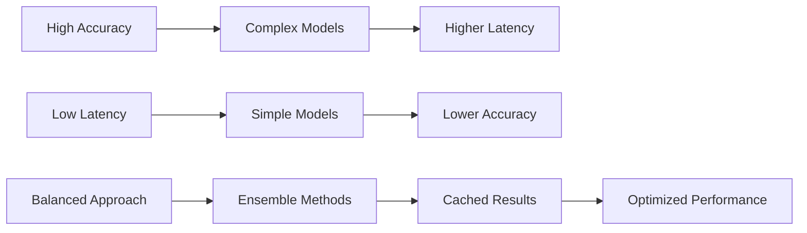

# Performance & Optimization

This guide covers performance optimization techniques for PaiRec algorithms in production environments. Learn how to profile, tune, and scale algorithms for maximum throughput and minimum latency.

## Table of Contents
- [Performance Overview](#performance-overview)
- [Profiling and Monitoring](#profiling-and-monitoring)
- [Algorithm-Specific Optimization](#algorithm-specific-optimization)
- [System-Level Optimization](#system-level-optimization)
- [Scaling Strategies](#scaling-strategies)
- [Memory Management](#memory-management)
- [Network Optimization](#network-optimization)
- [Production Deployment](#production-deployment)

## Performance Overview

### Key Performance Metrics

| Metric | Definition | Target | Impact |
|--------|------------|--------|---------|
| **Latency (P99)** | 99th percentile response time | < 100ms | User experience |
| **Throughput (QPS)** | Queries per second | > 1000 QPS | System capacity |
| **CPU Utilization** | Processor usage | < 70% | Resource efficiency |
| **Memory Usage** | RAM consumption | < 80% | System stability |
| **Error Rate** | Failed requests percentage | < 0.1% | Reliability |

### Performance Hierarchy

```
1. Algorithm Selection    (10x impact)
   ├── Simple vs Complex algorithms
   └── Local vs Remote computation

2. Implementation Quality (5x impact)
   ├── Efficient data structures
   └── Optimized algorithms

3. Configuration Tuning  (2x impact)
   ├── Timeouts and retries
   └── Connection pooling

4. Infrastructure        (1.5x impact)
   ├── Hardware resources
   └── Network optimization
```

### Performance vs Accuracy Trade-offs



## Profiling and Monitoring

### Go Profiling for Algorithm Performance

#### CPU Profiling

```go
package main

import (
    "os"
    "runtime/pprof"
    "time"
    
    "github.com/alibaba/pairec/v2/algorithm"
)

func profileAlgorithmCPU(algorithmName string, inputData interface{}) {
    // Start CPU profiling
    cpuFile, err := os.Create("cpu.prof")
    if err != nil {
        panic(err)
    }
    defer cpuFile.Close()
    
    pprof.StartCPUProfile(cpuFile)
    defer pprof.StopCPUProfile()
    
    // Warm up
    for i := 0; i < 10; i++ {
        algorithm.Run(algorithmName, inputData)
    }
    
    // Profile main execution
    start := time.Now()
    for i := 0; i < 1000; i++ {
        algorithm.Run(algorithmName, inputData)
    }
    duration := time.Since(start)
    
    fmt.Printf("Algorithm %s: %v per request\n", 
        algorithmName, duration/1000)
}
```

#### Memory Profiling

```go
func profileAlgorithmMemory(algorithmName string, inputData interface{}) {
    // Force GC before profiling
    runtime.GC()
    
    // Start memory profiling
    memFile, err := os.Create("mem.prof")
    if err != nil {
        panic(err)
    }
    defer memFile.Close()
    
    // Run algorithm multiple times
    for i := 0; i < 100; i++ {
        result, err := algorithm.Run(algorithmName, inputData)
        if err != nil {
            panic(err)
        }
        _ = result // Ensure result is used
    }
    
    // Write heap profile
    pprof.WriteHeapProfile(memFile)
}
```

#### Trace Analysis

```go
func traceAlgorithmExecution(algorithmName string, inputData interface{}) {
    // Start execution trace
    traceFile, err := os.Create("trace.out")
    if err != nil {
        panic(err)
    }
    defer traceFile.Close()
    
    trace.Start(traceFile)
    defer trace.Stop()
    
    // Execute algorithm with tracing
    result, err := algorithm.Run(algorithmName, inputData)
    if err != nil {
        panic(err)
    }
    
    // Process result to ensure it's not optimized away
    processResult(result)
}
```

### Prometheus Metrics Integration

```go
package monitoring

import (
    "time"
    
    "github.com/prometheus/client_golang/prometheus"
    "github.com/prometheus/client_golang/prometheus/promauto"
)

var (
    algorithmDuration = promauto.NewHistogramVec(
        prometheus.HistogramOpts{
            Name: "pairec_algorithm_duration_seconds",
            Help: "Time spent executing algorithms",
            Buckets: []float64{0.001, 0.005, 0.01, 0.025, 0.05, 0.1, 0.25, 0.5, 1, 2.5, 5, 10},
        },
        []string{"algorithm_name", "algorithm_type"},
    )
    
    algorithmRequests = promauto.NewCounterVec(
        prometheus.CounterOpts{
            Name: "pairec_algorithm_requests_total",
            Help: "Total number of algorithm requests",
        },
        []string{"algorithm_name", "algorithm_type", "status"},
    )
    
    algorithmInputSize = promauto.NewHistogramVec(
        prometheus.HistogramOpts{
            Name: "pairec_algorithm_input_size",
            Help: "Size of algorithm input",
            Buckets: prometheus.ExponentialBuckets(1, 2, 15), // 1, 2, 4, ..., 16384
        },
        []string{"algorithm_name"},
    )
)

type MetricsWrapper struct {
    underlying IAlgorithm
    name       string
    algType    string
}

func (m *MetricsWrapper) Run(algoData interface{}) (interface{}, error) {
    start := time.Now()
    
    // Record input size
    inputSize := getInputSize(algoData)
    algorithmInputSize.WithLabelValues(m.name).Observe(float64(inputSize))
    
    // Execute algorithm
    result, err := m.underlying.Run(algoData)
    
    // Record metrics
    duration := time.Since(start).Seconds()
    algorithmDuration.WithLabelValues(m.name, m.algType).Observe(duration)
    
    status := "success"
    if err != nil {
        status = "error"
    }
    algorithmRequests.WithLabelValues(m.name, m.algType, status).Inc()
    
    return result, err
}
```

### Real-time Performance Dashboard

Create Grafana dashboard queries:

```promql
# Average algorithm latency by type
rate(pairec_algorithm_duration_seconds_sum[5m]) / 
rate(pairec_algorithm_duration_seconds_count[5m])

# P95 latency
histogram_quantile(0.95, 
  rate(pairec_algorithm_duration_seconds_bucket[5m]))

# Request rate
rate(pairec_algorithm_requests_total[5m])

# Error rate
rate(pairec_algorithm_requests_total{status="error"}[5m]) /
rate(pairec_algorithm_requests_total[5m])
```

## Algorithm-Specific Optimization

### LOOKUP Algorithm Optimization

```go
// Optimized LOOKUP with pre-computed field access
type OptimizedLookupPolicy struct {
    conf      *recconf.LookupConfig
    fieldHash uint64  // Pre-computed field name hash
}

func (m *OptimizedLookupPolicy) Init(conf *recconf.AlgoConfig) error {
    m.conf = &conf.LookupConf
    m.fieldHash = hash(m.conf.FieldName)  // Pre-compute hash
    return nil
}

func (m *OptimizedLookupPolicy) Run(algoData interface{}) (interface{}, error) {
    featureList := algoData.([]map[string]interface{})
    if len(featureList) == 0 {
        return nil, nil
    }
    
    // Pre-allocate with exact capacity
    result := make([]response.AlgoResponse, len(featureList))
    
    // Optimized loop with fewer allocations
    for i := 0; i < len(featureList); i++ {
        if score, ok := featureList[i][m.conf.FieldName].(float64); ok {
            result[i] = &LookupResponse{score: score}
        } else {
            result[i] = &LookupResponse{score: 0.5}
        }
    }
    
    return result, nil
}
```

### FAISS Optimization

#### Connection Pooling

```go
type PooledFaissClient struct {
    pool    chan *VectorClient
    maxSize int
    address string
    timeout time.Duration
}

func NewPooledFaissClient(address string, timeout time.Duration, poolSize int) *PooledFaissClient {
    pool := make(chan *VectorClient, poolSize)
    
    // Pre-fill pool with connections
    for i := 0; i < poolSize; i++ {
        client, _ := NewVectorClient(address, timeout)
        pool <- client
    }
    
    return &PooledFaissClient{
        pool:    pool,
        maxSize: poolSize,
        address: address,
        timeout: timeout,
    }
}

func (p *PooledFaissClient) Search(requestData interface{}) (*pb.VectorReply, error) {
    // Get client from pool
    var client *VectorClient
    select {
    case client = <-p.pool:
        // Got client from pool
    default:
        // Pool empty, create new client
        var err error
        client, err = NewVectorClient(p.address, p.timeout)
        if err != nil {
            return nil, err
        }
    }
    
    // Execute search
    result, err := client.Search(requestData)
    
    // Return client to pool
    select {
    case p.pool <- client:
        // Returned to pool
    default:
        // Pool full, discard client
    }
    
    return result, err
}
```

#### Batch Processing

```go
type BatchedFaissModel struct {
    client    *VectorClient
    batchSize int
    timeout   time.Duration
}

func (m *BatchedFaissModel) Run(algoData interface{}) (interface{}, error) {
    requests := algoData.([]*pb.VectorRequest)
    
    var allResults []*pb.VectorReply
    
    // Process in batches
    for i := 0; i < len(requests); i += m.batchSize {
        end := min(i+m.batchSize, len(requests))
        batch := requests[i:end]
        
        // Create batch request
        batchRequest := &pb.BatchVectorRequest{
            Requests: batch,
        }
        
        batchResult, err := m.client.BatchSearch(batchRequest)
        if err != nil {
            return nil, err
        }
        
        allResults = append(allResults, batchResult.Results...)
    }
    
    return allResults, nil
}
```

### EAS Optimization

#### Request Compression

```go
type CompressedEasRequest struct {
    baseRequest IEasRequest
    compressor  Compressor
}

func (r *CompressedEasRequest) Invoke(algoData interface{}) (interface{}, error) {
    // Compress request data
    compressedData, err := r.compressor.Compress(algoData)
    if err != nil {
        return nil, err
    }
    
    // Set compression headers
    headers := map[string]string{
        "Content-Encoding": "gzip",
        "Content-Type":     "application/json",
    }
    
    return r.baseRequest.InvokeWithHeaders(compressedData, headers)
}
```

#### Connection Keep-Alive

```go
type OptimizedEasClient struct {
    httpClient *http.Client
    url        string
}

func NewOptimizedEasClient(url string, timeout time.Duration) *OptimizedEasClient {
    transport := &http.Transport{
        MaxIdleConns:        100,
        MaxIdleConnsPerHost: 20,
        IdleConnTimeout:     90 * time.Second,
        DisableKeepAlives:   false,
        
        // Connection pooling
        DialContext: (&net.Dialer{
            Timeout:   30 * time.Second,
            KeepAlive: 30 * time.Second,
        }).DialContext,
        
        // TLS optimization
        TLSHandshakeTimeout: 10 * time.Second,
        TLSClientConfig: &tls.Config{
            InsecureSkipVerify: false,
            ClientSessionCache: tls.NewLRUClientSessionCache(64),
        },
    }
    
    return &OptimizedEasClient{
        httpClient: &http.Client{
            Transport: transport,
            Timeout:   timeout,
        },
        url: url,
    }
}
```

### Milvus Optimization

#### Connection Management

```go
type OptimizedMilvusClient struct {
    client     client.Client
    pool       *sync.Pool
    maxRetries int
}

func NewOptimizedMilvusClient(address string) *OptimizedMilvusClient {
    // Connection pool for request contexts
    pool := &sync.Pool{
        New: func() interface{} {
            return context.Background()
        },
    }
    
    client, _ := client.NewGrpcClient(context.Background(), address)
    
    return &OptimizedMilvusClient{
        client:     client,
        pool:       pool,
        maxRetries: 3,
    }
}

func (m *OptimizedMilvusClient) SearchWithRetry(request *MilvusRequest) (interface{}, error) {
    var lastErr error
    
    for attempt := 0; attempt < m.maxRetries; attempt++ {
        ctx := m.pool.Get().(context.Context)
        
        result, err := m.client.Search(
            ctx,
            request.CollectionName,
            request.Partitions,
            request.Expr,
            request.OutputFields,
            request.Vectors,
            request.VectorField,
            request.MetricType,
            request.TopK,
            request.SearchParams,
        )
        
        m.pool.Put(ctx)
        
        if err == nil {
            return result, nil
        }
        
        lastErr = err
        
        // Exponential backoff
        if attempt < m.maxRetries-1 {
            time.Sleep(time.Duration(math.Pow(2, float64(attempt))) * 100 * time.Millisecond)
        }
    }
    
    return nil, lastErr
}
```

## System-Level Optimization

### Goroutine Pool Management

```go
type WorkerPool struct {
    workers    chan chan AlgorithmJob
    jobQueue   chan AlgorithmJob
    maxWorkers int
    quit       chan bool
}

type AlgorithmJob struct {
    Algorithm string
    Data      interface{}
    Result    chan AlgorithmResult
}

type AlgorithmResult struct {
    Response interface{}
    Error    error
}

func NewWorkerPool(maxWorkers int, maxQueue int) *WorkerPool {
    pool := &WorkerPool{
        workers:    make(chan chan AlgorithmJob, maxWorkers),
        jobQueue:   make(chan AlgorithmJob, maxQueue),
        maxWorkers: maxWorkers,
        quit:       make(chan bool),
    }
    
    // Start workers
    for i := 0; i < maxWorkers; i++ {
        worker := NewWorker(pool.workers, pool.quit)
        worker.Start()
    }
    
    // Start dispatcher
    go pool.dispatch()
    
    return pool
}

func (p *WorkerPool) dispatch() {
    for {
        select {
        case job := <-p.jobQueue:
            // Get available worker
            worker := <-p.workers
            worker <- job
        case <-p.quit:
            return
        }
    }
}

func (p *WorkerPool) Submit(algorithmName string, data interface{}) <-chan AlgorithmResult {
    resultChan := make(chan AlgorithmResult, 1)
    
    job := AlgorithmJob{
        Algorithm: algorithmName,
        Data:      data,
        Result:    resultChan,
    }
    
    select {
    case p.jobQueue <- job:
        return resultChan
    default:
        // Queue full, return error immediately
        go func() {
            resultChan <- AlgorithmResult{
                Error: fmt.Errorf("worker pool queue full"),
            }
        }()
        return resultChan
    }
}
```

### Memory Pool for Responses

```go
var responsePool = sync.Pool{
    New: func() interface{} {
        return make([]response.AlgoResponse, 0, 100) // Pre-allocate capacity
    },
}

func getResponseSlice() []response.AlgoResponse {
    return responsePool.Get().([]response.AlgoResponse)
}

func returnResponseSlice(slice []response.AlgoResponse) {
    // Clear slice
    for i := range slice {
        slice[i] = nil
    }
    slice = slice[:0]
    
    responsePool.Put(slice)
}

// Usage in algorithm
func (m *OptimizedModel) Run(algoData interface{}) (interface{}, error) {
    responses := getResponseSlice()
    defer returnResponseSlice(responses)
    
    // Process data and populate responses
    for _, item := range inputData {
        response := processItem(item)
        responses = append(responses, response)
    }
    
    // Return copy to avoid mutation after return
    result := make([]response.AlgoResponse, len(responses))
    copy(result, responses)
    
    return result, nil
}
```

### CPU and Memory Optimization

#### GOMAXPROCS Tuning

```go
import "go.uber.org/automaxprocs/maxprocs"

func init() {
    // Automatically set GOMAXPROCS based on container limits
    maxprocs.Set(maxprocs.Logger(func(string, ...interface{}) {}))
}
```

#### GC Tuning

```go
func optimizeGC() {
    // Reduce GC pressure for high-throughput scenarios
    debug.SetGCPercent(200) // Default is 100
    
    // For latency-sensitive workloads
    debug.SetGCPercent(50)  // More frequent GC, lower latency
}
```

## Scaling Strategies

### Horizontal Scaling

#### Load Balancer Configuration

```yaml
# nginx.conf
upstream pairec_backend {
    least_conn;
    server pairec-1:8000 max_fails=3 fail_timeout=30s;
    server pairec-2:8000 max_fails=3 fail_timeout=30s;
    server pairec-3:8000 max_fails=3 fail_timeout=30s;
    keepalive 32;
}

server {
    listen 80;
    
    location /api/recommend {
        proxy_pass http://pairec_backend;
        proxy_http_version 1.1;
        proxy_set_header Connection "";
        proxy_set_header Host $host;
        
        # Performance optimizations
        proxy_buffering on;
        proxy_buffer_size 4k;
        proxy_buffers 8 4k;
        proxy_connect_timeout 5s;
        proxy_send_timeout 10s;
        proxy_read_timeout 10s;
    }
}
```

#### Kubernetes Deployment

```yaml
apiVersion: apps/v1
kind: Deployment
metadata:
  name: pairec-algorithms
spec:
  replicas: 5
  selector:
    matchLabels:
      app: pairec
  template:
    metadata:
      labels:
        app: pairec
    spec:
      containers:
      - name: pairec
        image: pairec:optimized
        resources:
          requests:
            memory: "512Mi"
            cpu: "500m"
          limits:
            memory: "1Gi"
            cpu: "1000m"
        env:
        - name: GOMAXPROCS
          valueFrom:
            resourceFieldRef:
              resource: limits.cpu
        - name: GOMEMLIMIT
          valueFrom:
            resourceFieldRef:
              resource: limits.memory
        ports:
        - containerPort: 8000
        livenessProbe:
          httpGet:
            path: /health
            port: 8000
          initialDelaySeconds: 30
          periodSeconds: 10
        readinessProbe:
          httpGet:
            path: /ready
            port: 8000
          initialDelaySeconds: 5
          periodSeconds: 5

---
apiVersion: v1
kind: Service
metadata:
  name: pairec-service
spec:
  selector:
    app: pairec
  ports:
  - port: 80
    targetPort: 8000
  type: LoadBalancer

---
apiVersion: autoscaling/v2
kind: HorizontalPodAutoscaler
metadata:
  name: pairec-hpa
spec:
  scaleTargetRef:
    apiVersion: apps/v1
    kind: Deployment
    name: pairec-algorithms
  minReplicas: 3
  maxReplicas: 20
  metrics:
  - type: Resource
    resource:
      name: cpu
      target:
        type: Utilization
        averageUtilization: 70
  - type: Resource
    resource:
      name: memory
      target:
        type: Utilization
        averageUtilization: 80
```

### Vertical Scaling

#### Resource Sizing Guidelines

| Load Level | CPU | Memory | Replicas | Expected QPS |
|------------|-----|--------|----------|--------------|
| **Light** | 500m | 512Mi | 2-3 | 100-500 |
| **Medium** | 1000m | 1Gi | 3-5 | 500-2000 |
| **Heavy** | 2000m | 2Gi | 5-10 | 2000-10000 |
| **Enterprise** | 4000m | 4Gi | 10-20 | 10000+ |

#### JVM-style Memory Management (if using cgo)

```go
func configureCGoMemory() {
    // Set memory limits for C libraries
    cgo.SetMaxMemory(1 << 30) // 1GB limit
    
    // Configure memory allocator
    os.Setenv("MALLOC_ARENA_MAX", "2")
    os.Setenv("MALLOC_MMAP_THRESHOLD_", "131072")
}
```

## Memory Management

### Object Pooling Strategies

```go
// Response pool manager
type ResponsePoolManager struct {
    pools map[string]*sync.Pool
    mutex sync.RWMutex
}

func (rpm *ResponsePoolManager) GetPool(algorithmType string) *sync.Pool {
    rpm.mutex.RLock()
    pool, exists := rpm.pools[algorithmType]
    rpm.mutex.RUnlock()
    
    if !exists {
        rpm.mutex.Lock()
        defer rpm.mutex.Unlock()
        
        // Double-check pattern
        if pool, exists = rpm.pools[algorithmType]; !exists {
            pool = &sync.Pool{
                New: func() interface{} {
                    return createResponseForType(algorithmType)
                },
            }
            rpm.pools[algorithmType] = pool
        }
    }
    
    return pool
}

// String interning for common values
type StringInterner struct {
    intern map[string]string
    mutex  sync.RWMutex
}

func (si *StringInterner) Intern(s string) string {
    si.mutex.RLock()
    if interned, exists := si.intern[s]; exists {
        si.mutex.RUnlock()
        return interned
    }
    si.mutex.RUnlock()
    
    si.mutex.Lock()
    defer si.mutex.Unlock()
    
    // Double-check
    if interned, exists := si.intern[s]; exists {
        return interned
    }
    
    si.intern[s] = s
    return s
}
```

### Memory Leak Prevention

```go
// Reference tracking for debugging
type ReferenceTracker struct {
    refs map[uintptr]string
    mutex sync.RWMutex
}

func (rt *ReferenceTracker) Track(obj interface{}, name string) {
    rt.mutex.Lock()
    defer rt.mutex.Unlock()
    
    ptr := reflect.ValueOf(obj).Pointer()
    rt.refs[ptr] = name
}

func (rt *ReferenceTracker) Untrack(obj interface{}) {
    rt.mutex.Lock()
    defer rt.mutex.Unlock()
    
    ptr := reflect.ValueOf(obj).Pointer()
    delete(rt.refs, ptr)
}

// Automatic cleanup for long-running operations
type CleanupManager struct {
    cleanupFuncs []func()
    mutex        sync.Mutex
}

func (cm *CleanupManager) Register(cleanup func()) {
    cm.mutex.Lock()
    defer cm.mutex.Unlock()
    
    cm.cleanupFuncs = append(cm.cleanupFuncs, cleanup)
}

func (cm *CleanupManager) Cleanup() {
    cm.mutex.Lock()
    defer cm.mutex.Unlock()
    
    for _, cleanup := range cm.cleanupFuncs {
        cleanup()
    }
    cm.cleanupFuncs = cm.cleanupFuncs[:0]
}
```

## Network Optimization

### Connection Management

```go
type OptimizedHTTPTransport struct {
    transport *http.Transport
}

func NewOptimizedHTTPTransport() *OptimizedHTTPTransport {
    transport := &http.Transport{
        // Connection pooling
        MaxIdleConns:        100,
        MaxIdleConnsPerHost: 20,
        MaxConnsPerHost:     50,
        IdleConnTimeout:     90 * time.Second,
        
        // Timeouts
        DialContext: (&net.Dialer{
            Timeout:   5 * time.Second,
            KeepAlive: 30 * time.Second,
            DualStack: true,
        }).DialContext,
        
        // TLS optimization
        TLSHandshakeTimeout: 5 * time.Second,
        TLSClientConfig: &tls.Config{
            InsecureSkipVerify: false,
            ClientSessionCache: tls.NewLRUClientSessionCache(128),
            MinVersion:         tls.VersionTLS12,
        },
        
        // Response handling
        ResponseHeaderTimeout: 10 * time.Second,
        ExpectContinueTimeout: 1 * time.Second,
        
        // Compression
        DisableCompression: false,
    }
    
    return &OptimizedHTTPTransport{transport: transport}
}
```

### Request Batching

```go
type BatchingAlgorithmProxy struct {
    underlying   IAlgorithm
    batchSize    int
    batchTimeout time.Duration
    queue        chan BatchItem
    results      map[string]chan BatchResult
    mutex        sync.RWMutex
}

type BatchItem struct {
    ID   string
    Data interface{}
}

type BatchResult struct {
    Result interface{}
    Error  error
}

func (b *BatchingAlgorithmProxy) Run(algoData interface{}) (interface{}, error) {
    requestID := generateRequestID()
    resultChan := make(chan BatchResult, 1)
    
    // Register result channel
    b.mutex.Lock()
    b.results[requestID] = resultChan
    b.mutex.Unlock()
    
    // Add to batch queue
    select {
    case b.queue <- BatchItem{ID: requestID, Data: algoData}:
        // Successfully queued
    case <-time.After(b.batchTimeout):
        return nil, fmt.Errorf("batch queue timeout")
    }
    
    // Wait for result
    select {
    case result := <-resultChan:
        return result.Result, result.Error
    case <-time.After(b.batchTimeout * 2):
        return nil, fmt.Errorf("batch processing timeout")
    }
}

func (b *BatchingAlgorithmProxy) processBatches() {
    batch := make([]BatchItem, 0, b.batchSize)
    ticker := time.NewTicker(b.batchTimeout)
    defer ticker.Stop()
    
    for {
        select {
        case item := <-b.queue:
            batch = append(batch, item)
            
            if len(batch) >= b.batchSize {
                b.executeBatch(batch)
                batch = batch[:0]
            }
            
        case <-ticker.C:
            if len(batch) > 0 {
                b.executeBatch(batch)
                batch = batch[:0]
            }
        }
    }
}
```

## Production Deployment

### Configuration for Production

```json
{
  "performance": {
    "worker_pool_size": 100,
    "max_concurrent_requests": 1000,
    "request_timeout_ms": 5000,
    "enable_pooling": true,
    "gc_percent": 150
  },
  "monitoring": {
    "enable_metrics": true,
    "metrics_interval_seconds": 10,
    "enable_tracing": true,
    "sample_rate": 0.01
  },
  "optimization": {
    "enable_compression": true,
    "enable_keep_alive": true,
    "max_idle_connections": 100,
    "connection_timeout_seconds": 30
  }
}
```

### Docker Optimization

```dockerfile
# Multi-stage build for minimal image
FROM golang:1.21-alpine AS builder

WORKDIR /app
COPY go.mod go.sum ./
RUN go mod download

COPY . .

# Build with optimizations
RUN CGO_ENABLED=0 GOOS=linux go build \
    -ldflags="-w -s" \
    -o pairec .

FROM alpine:latest

# Add ca-certificates for HTTPS
RUN apk --no-cache add ca-certificates

WORKDIR /root/

# Copy binary
COPY --from=builder /app/pairec .

# Set resource limits
ENV GOMAXPROCS=2
ENV GOMEMLIMIT=1GiB

# Expose port
EXPOSE 8000

# Health check
HEALTHCHECK --interval=30s --timeout=5s --start-period=10s --retries=3 \
    CMD wget --no-verbose --tries=1 --spider http://localhost:8000/health || exit 1

CMD ["./pairec"]
```

### Monitoring and Alerting

```yaml
# Prometheus alerting rules
groups:
- name: pairec-algorithms
  rules:
  - alert: HighLatency
    expr: histogram_quantile(0.95, rate(pairec_algorithm_duration_seconds_bucket[5m])) > 0.1
    for: 2m
    labels:
      severity: warning
    annotations:
      summary: "High algorithm latency detected"
      description: "P95 latency is {{ $value }}s"

  - alert: HighErrorRate
    expr: rate(pairec_algorithm_requests_total{status="error"}[5m]) / rate(pairec_algorithm_requests_total[5m]) > 0.01
    for: 1m
    labels:
      severity: critical
    annotations:
      summary: "High algorithm error rate"
      description: "Error rate is {{ $value | humanizePercentage }}"

  - alert: LowThroughput
    expr: rate(pairec_algorithm_requests_total[5m]) < 100
    for: 5m
    labels:
      severity: warning
    annotations:
      summary: "Low algorithm throughput"
      description: "Request rate is {{ $value }} req/s"
```

---

## Summary

Performance optimization in PaiRec involves multiple layers:

- **Profiling and monitoring** to identify bottlenecks
- **Algorithm-specific optimizations** for each algorithm type
- **System-level tuning** including memory management and connection pooling
- **Scaling strategies** for handling increased load
- **Production deployment** with proper configuration and monitoring

### Key Performance Principles

1. **Measure before optimizing** - Use profiling to identify real bottlenecks
2. **Optimize the right layer** - Algorithm choice has more impact than micro-optimizations
3. **Consider trade-offs** - Balance accuracy, latency, and resource usage
4. **Monitor continuously** - Use metrics to detect performance regressions
5. **Scale appropriately** - Choose horizontal or vertical scaling based on workload

### Next Steps

- **[API Reference](10-api-reference.md)** - Complete technical documentation
- **Production Deployment**: Apply these optimizations to your production environment
- **Continuous Monitoring**: Set up dashboards and alerting for performance metrics